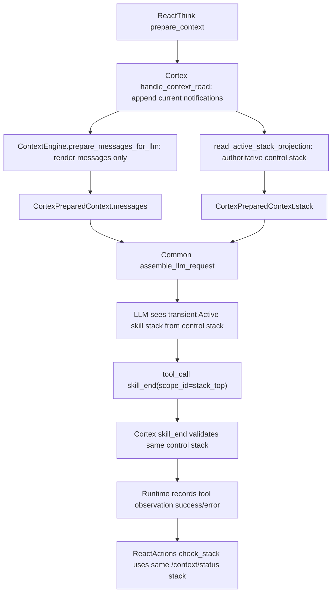
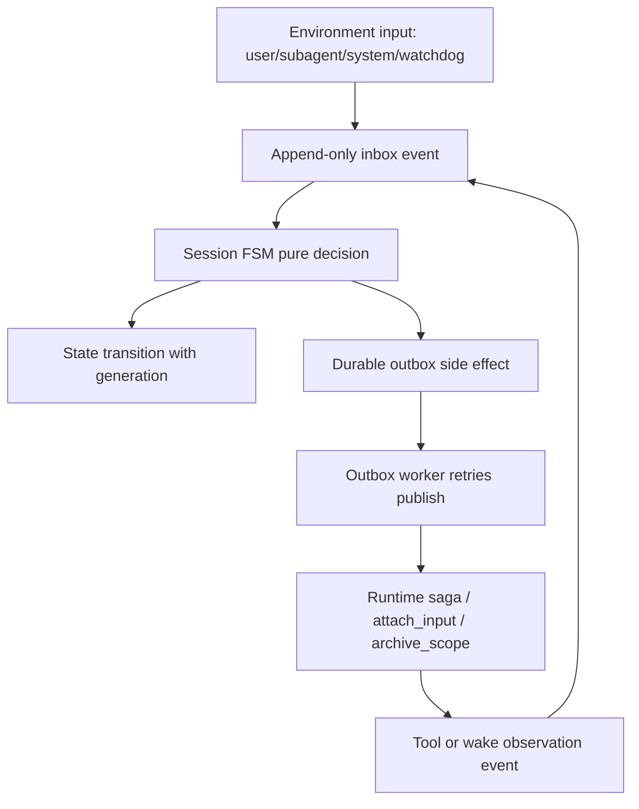

# Agent Loop 控制面一致性设计

本文定义 Agent Runtime、Cortex、Common LLM assembly 在 **Active skill stack / tool result / wake finalize** 上的控制面一致性目标。它不是事故复盘文档，而是后续实现 PR 的设计契约。

## 1. 背景

近期 Agent loop 出现过连续多轮 `skill_end` 失败：

- LLM prompt 中的 `[Active skill stack]` 指向 `cortex-skill-review-8ed21bdc`。
- Cortex `skill_end` 实际校验的栈顶是当前 wake scope。
- LLM 按 prompt 反复调用旧 `scope_id`，工具反复返回 scope mismatch。
- Runtime 没有把 `{"ok": false}` 识别为工具逻辑失败，也没有重复错误熔断。
- 最终依赖 `round_cap` 强制 `wake_finalize`，不是自然闭合。

这个现象的根因不是“LLM 重试错误”，而是控制面事实源分裂：

| 面向 | 当前来源 | 问题 |
|---|---|---|
| LLM 可见 Active skill stack | `ContextEngine.status().frames` | 来自 context render tree，可能包含不在 active path 上的 open scope |
| `skill_end` 校验栈顶 | Cortex SQLite active stack projection | 真实控制栈 |
| Runtime finalize 决策 | `CORTEX_CHECK_STACK` / `/v1/context/status` | 真实控制栈，但与 prompt stack 可能不一致 |
| 工具结果成功判断 | Runtime `_executor_success()` | 只认 `success:false`，不认 `ok:false` |

## 2. 目标

1. **控制栈单一真相源**：LLM prompt、`skill_end`、`check_stack`、finalize 决策必须使用同一个 authoritative stack snapshot。
2. **ContextEngine 只负责渲染**：它可以提供 messages、folded summaries、token 信息，但不能产出可执行控制指令。
3. **工具失败语义统一**：`success:false`、`ok:false`、异常、业务校验失败都必须进入统一 error observation。
4. **重复错误必须收敛**：同一个工具错误不能重复到 round cap；必须在短阈值内进入 correction / recovery / forced finalize。
5. **round cap 只做事故刹车**：不伪装成 `stack_empty=true`，必须明确记录 `force_finalize_reason=round_cap`。

## 3. 非目标

- 不改变 `skill_begin` / `skill_end` 的 LIFO 语义。
- 不引入 LLM 可调用的 `finalize` / `rest` 工具。
- 不让 Runtime 从 `im_reply`、聊天内容或 summary 文本推断 scope 状态。
- 不让 Business 或 Entangled 参与 Cortex scope 控制栈判定。

## 4. 核心不变量

### INV-A · 控制栈 SSOT

任何用于控制行为的 stack 必须来自 Cortex SQLite active stack projection：

```text
read_active_stack_projection(root_scope_id)
  -> frames[0]
  -> current stack_top + active_scope_path
```

适用范围：

- `/v1/context/status`
- `/v1/context/skill_begin`
- `/v1/context/skill_end`
- `/v1/context/prepare_for_llm` 返回给 Runtime 的 `stack`
- Common `format_active_skill_stack_message()`
- Runtime `react_actions` finalize decision

### INV-B · 渲染栈不是控制栈

`ContextEngine.status().frames` 只能作为 render diagnostics：

- `messages` 拼装、fold、token 估算可以继续走 ContextEngine。
- `frames` 不得再作为 `[Active skill stack]` 的数据源。
- 如果 render open scopes 与 active path stack 不一致，只能打 drift log / metric，不能影响 LLM 指令。

### INV-C · 工具逻辑失败必须显式失败

任何工具结果满足以下之一，都必须记录为 `tool_success=false`：

- `result.success is false`
- `result.ok is false`
- executor 抛异常
- Cortex business validation 失败，如 `scope_mismatch`

Queue task 可以是 completed，表示“工具调用执行流程完成”；但 tool observation 必须是 error，不能把业务失败包装成 completed success。

### INV-D · 重复同错熔断

同一个 wake 内，同一类工具错误的 fingerprint 连续出现超过阈值时，必须退出普通 think loop。

建议 fingerprint：

```json
{
  "tool_name": "skill_end",
  "error_code": "scope_mismatch",
  "requested_scope_id": "...",
  "actual_stack_top": "..."
}
```

默认阈值：2 次。

### INV-E · 强制 finalize 不等于 stack empty

`round_cap`、`repeated_scope_mismatch`、`dead_active_session_recovery` 等强制收口必须显式记录原因：

```json
{
  "should_finalize": true,
  "stack_empty": false,
  "force_finalize_reason": "round_cap",
  "stack_depth_at_finalize": 1
}
```

## 5. 目标架构



关键点：`F` 和 `J` 必须同源。只要 LLM 看到的 `stack_top` 与工具校验的 `stack_top` 同源，就不会出现“系统提示 A、工具验 B”的结构性分裂。

## 6. 技术改动点

### 6.1 Cortex `prepare_for_llm` 使用 authoritative stack

文件：

- `novaic-cortex/novaic_cortex/api.py`
- `novaic-cortex/novaic_cortex/context_stack/engine.py`

改动：

1. `context_prepare_for_llm()` 继续用 `ContextEngine.prepare_messages_for_llm()` 生成 messages。
2. `stack` 改为 `read_active_stack_projection(ws, root_scope_id)`。
3. `estimated_tokens`、`total_messages` 仍可来自 `ContextEngine.status(messages)`。
4. `ContextEngine.status().frames` 改名或注释为 render-only diagnostic，避免误用。

验收：

- `/v1/context/prepare_for_llm` 返回的 `stack` 与 `/v1/context/status.frames` 一致。
- Common assembly 的 `[Active skill stack]` 只由该 `stack` 渲染。

### 6.2 Stack drift 观测

文件：

- `novaic-cortex/novaic_cortex/api.py`
- `novaic-cortex/novaic_cortex/observability.py`

改动：

1. 在 `prepare_for_llm` 中同时计算：
   - `control_stack = read_active_stack_projection(...)`
   - `render_stack = ContextEngine.status(messages).frames`
2. 如果二者不一致：
   - 不阻断请求。
   - LLM prompt 继续使用 `control_stack`。
   - 记录结构化日志：

```text
event=stack_drift_detected
root_scope_id=...
control_stack_top=...
render_stack_top=...
render_open_scope_count=...
```

3. 指标：
   - `cortex_stack_drift_total`

验收：

- drift 不再污染 prompt。
- 生产可以通过日志与指标定位 orphan open scope。

### 6.3 工具失败语义统一

文件：

- `novaic-agent-runtime/task_queue/handlers/tool_handlers.py`
- `novaic-agent-runtime/task_queue/contracts/react_actions.py`

改动：

```python
def _executor_success(result) -> bool:
    if not isinstance(result, dict):
        return True
    if result.get("success") is False:
        return False
    if result.get("ok") is False:
        return False
    return True
```

保存 tool step 时：

- `tool_success=false`
- `tool_status="error"`
- `status="error"` 或至少 observation status 为 error
- `error_code`、`error`、`actual_stack_top` 保留在 content / observation 中

验收：

- `skill_end` 返回 `ok:false` 时，下一轮 LLM 看到的是 error observation。
- 不再出现 `ok:false` 但 tool projection 显示 completed 的状态。

### 6.4 `skill_end` mismatch 结构化返回

文件：

- `novaic-cortex/novaic_cortex/api.py`
- `novaic-agent-runtime/task_queue/utils/cortex_bridge.py`
- `novaic-agent-runtime/task_queue/handlers/tool_handlers.py`

改动：

`/v1/context/skill_end` 在 LIFO mismatch 时返回：

```json
{
  "ok": false,
  "error_code": "scope_mismatch",
  "error": "scope_id mismatch...",
  "requested_scope_id": "cortex-skill-review-8ed21bdc",
  "actual_stack_top": "03161b28-1d47-4f17-a0b6-328de1d2e327",
  "stack": [...],
  "stack_depth": 1
}
```

Runtime 不把这些字段吞掉，原样进入 tool observation。

验收：

- UI / activity timeline / Cortex step payload 能看到 error_code 与 actual_stack_top。
- 下一轮 prompt 能从最近 tool result 明确得知“不要重试旧 scope_id”。

### 6.5 重复错误熔断

文件：

- `novaic-agent-runtime/task_queue/contracts/react_actions.py`
- `novaic-agent-runtime/task_queue/sagas/react_actions.py`
- `novaic-agent-runtime/queue_service/saga_repo.py`

改动：

1. 在 saga context 中维护：

```json
{
  "last_tool_error_fingerprint": "...",
  "same_tool_error_count": 2
}
```

2. fingerprint 连续达到阈值时，进入 recovery 分支：
   - 重新读取 `/v1/context/status`
   - 注入 corrective system note，或直接 forced finalize
   - `force_finalize_reason="repeated_scope_mismatch"`

3. 不等待 `round_cap`。

验收：

- 同一个 `skill_end scope_mismatch` 最多重复 2 轮。
- 第 3 次之前必须进入 recovery / finalize。

### 6.6 Round cap 语义修正

文件：

- `novaic-agent-runtime/task_queue/contracts/react_actions.py`
- `novaic-agent-runtime/task_queue/sagas/react_actions.py`
- `novaic-agent-runtime/task_queue/sagas/wake_finalize.py`

改动：

当前 `round_cap` 返回 `stack_empty=true`，应改为：

```json
{
  "should_finalize": true,
  "stack_empty": false,
  "force_finalize_reason": "round_cap",
  "stack_depth": 1,
  "round_num": 40
}
```

如果现有 SagaDefinition 只认 `stack_empty` 作为 finalize 条件，则新增显式字段：

- `should_finalize`
- `should_continue`

避免把“强制收口”伪装成“栈空”。

验收：

- 日志、metrics、finalize context 均能区分 natural finalize 与 forced finalize。
- `round_cap` 不再污染 stack-empty 指标。

### 6.7 Transient prompt message 防持久污染

文件：

- `novaic-common/common/contracts/llm_assembly.py`
- `novaic-agent-runtime/common/contracts/llm_assembly.py`
- `novaic-cortex/novaic_cortex/context_stack/engine.py`

改动：

`format_active_skill_stack_message()` 生成的 message 加 metadata：

```json
{
  "role": "system",
  "content": "[Active skill stack...]",
  "_metadata": {
    "skill_stack_snapshot": true,
    "transient": true,
    "source": "control_stack"
  }
}
```

ContextEngine prepare 时过滤掉已持久化的旧 stack snapshot：

- 如果 `context.jsonl` 中出现 `_metadata.skill_stack_snapshot=true`
- 或 content 以 `[Active skill stack` 开头
- 不进入最终 messages

验收：

- 每轮最多一个 Active skill stack system message。
- 它永远位于 assembly 阶段末尾，由最新 control stack 生成。

### 6.8 Orphan open scope scanner / repair

文件：

- `novaic-cortex/novaic_cortex/workspace.py`
- `novaic-cortex/novaic_cortex/api.py`
- `novaic-agent-runtime/task_queue/workers/health_worker.py`

改动：

1. Cortex 增加只读 scanner：
   - 遍历 root 下所有 open scope。
   - 计算 active path。
   - 不在 active path 上的 open scope 标记为 orphan。

2. 初期只 report：

```json
{
  "orphan_open_scopes": [
    {"scope_id": "...", "path": "...", "parent": "..."}
  ]
}
```

3. 后续由 repair endpoint 或 health worker 归档：

```text
Auto-archived by Cortex control-plane repair: orphan open scope not on active path.
```

验收：

- 正常 active root 下 `orphan_open_scope_count=0`。
- repair 不影响 active path 上的 current wake / child skill。

## 7. 数据与状态字段

### 7.1 Stack frame contract

统一 frame 结构：

```json
{
  "depth": 0,
  "scope_id": "wake-current",
  "skill_name": "wake",
  "scope_path": "/ro/active/agent-root-main/steps/0001_scope_wake-current",
  "source": "active_path"
}
```

排序建议：root child -> top，即 prompt 展示顺序与 `depth` 一致。栈顶取最后一个 frame。

### 7.2 Tool error observation

```json
{
  "kind": "tool_result",
  "tool": "skill_end",
  "status": "error",
  "success": false,
  "error_code": "scope_mismatch",
  "requested_scope_id": "cortex-skill-review-8ed21bdc",
  "actual_stack_top": "03161b28-1d47-4f17-a0b6-328de1d2e327",
  "summary": "scope_id mismatch..."
}
```

### 7.3 Finalize decision

```json
{
  "should_finalize": true,
  "stack_empty": false,
  "force_finalize_reason": "repeated_scope_mismatch",
  "stack_depth_at_finalize": 1,
  "round_num": 23
}
```

## 8. 测试计划

### Cortex

- `test_prepare_for_llm_stack_matches_context_status`
- `test_prepare_for_llm_uses_control_stack_when_render_stack_drifts`
- `test_context_status_and_skill_end_share_same_stack_top`
- `test_orphan_open_scope_does_not_enter_active_skill_stack`
- `test_active_stack_frame_order_contract`

### Runtime

- `test_ok_false_tool_result_marks_tool_error`
- `test_skill_end_scope_mismatch_records_error_observation`
- `test_repeated_scope_mismatch_breaks_before_round_cap`
- `test_round_cap_does_not_report_stack_empty`
- `test_forced_finalize_records_reason_and_stack_depth`

### Common assembly

- `test_active_stack_snapshot_has_transient_metadata`
- `test_persisted_active_stack_snapshot_is_filtered`
- `test_stack_message_uses_last_frame_as_top`

### Integration

构造流程：

1. 创建 agent-root + wake。
2. 创建 child skill。
3. 人为制造 render tree open scope 与 active path drift。
4. 调 `prepare_for_llm`。
5. 断言 LLM stack 使用 active path。
6. 让 LLM 模拟调用旧 scope `skill_end`。
7. 断言 tool observation 是 error。
8. 连续两次后触发 recovery / forced finalize，而不是跑到 round cap。

## 9. 观测指标

| 指标 | 目标 |
|---|---|
| `cortex_stack_drift_total` | 正常路径为 0 |
| `tool_logical_failure_as_success_total` | 必须为 0 |
| `skill_end_scope_mismatch_total` | 不持续增长 |
| `agent_loop_repeated_tool_error_total` | 只在异常恢复场景出现 |
| `turn_finalizer_total{reason="round_cap"}` | 正常用户路径接近 0 |
| `cortex_orphan_open_scope_total` | 正常路径为 0 |
| `cortex_orphan_scope_repaired_total` | 只在 repair 场景出现 |

## 10. 实施顺序

1. PR-A：Cortex `prepare_for_llm` stack 改为 SQLite active stack projection，并加 drift log。
2. PR-B：Runtime `_executor_success` 识别 `ok:false`，tool observation 统一 error。
3. PR-C：`skill_end` mismatch 结构化返回。
4. PR-D：重复工具错误熔断与 recovery / forced finalize。
5. PR-E：round cap 语义修正，不再伪装 stack empty。
6. PR-F：Active stack transient metadata + persisted snapshot 过滤。
7. PR-G：orphan open scope scanner / repair。

## 11. 回滚策略

- PR-A 可通过配置开关临时回退到旧 stack source，但默认必须使用 control stack。
- PR-B 不建议回滚；若回滚会恢复 `ok:false` 假成功风险。
- PR-D 可先以 observe-only 模式上线，只打重复错误指标，不强制 finalize。
- PR-G 初期必须 report-only，上线观察后再开启 auto repair。

## 12. 完成定义

本设计完成时必须满足：

1. LLM prompt 中的 Active skill stack 与 `/v1/context/status.frames` 完全一致。
2. `skill_end` mismatch 在 Cortex step 中显示为 error observation。
3. 同一 scope mismatch 不会重复超过阈值。
4. `round_cap` 不再被统计为 natural stack-empty finalize。
5. 测试覆盖 Cortex / Runtime / Common assembly 三层。
6. 生产可通过指标判断是否存在 stack drift、orphan open scope、重复工具错误。

## 13. 下一代 Harness FSM 治本方向

PR-233 / PR-234 将当前系统从隐式协调推进到显式 session coordinator：

- 新 IM 不再天然创建新 wake。
- Active wake 优先接收可 attach 的输入。
- Cortex active path 成为 skill stack 控制面单一事实源。
- `ok:false` 工具结果进入显式 error observation。
- 重复 `scope_mismatch` 会在短阈值内强制收口，而不是拖到 round cap。

这解决了当前事故路径，但更彻底的 harness 形态应继续演进为
**append-only inbox + durable outbox + generation-checked FSM**。

这里的“治本”含义不是保证没有任何未来 bug，而是消除这类 harness 事故的结构根因：

- 隐式状态。
- 非持久 side effect。
- active session authority 漂移。
- 消息触达与 wake 生命周期混在一起。
- watchdog / recovery / finalize 多入口各自改状态。

### 13.1 主体 / 环境 / 工具边界

本系统的边界原则：

- Agent 是主体。
- 用户是环境的一部分，不是 wake lifecycle 的直接驱动器。
- Environment notification、IM、system wake、watchdog 都是环境输入事件。
- Shell sandbox、display、audio、subagent、HTTP 工具都是 agent 可调用工具。
- Harness 负责可靠投递环境事件、记录 agent 动作、恢复 runtime 容器；不替 agent 思考任务语义。

因此，用户消息不应直接等价于“创建一个新 wake”。它只是 `InputEvent(user_message)`。
是否创建 wake、attach 到当前 wake、进入 pending inbox、或触发 recovery，必须由 session FSM
根据当前 runtime 状态和显式输入决定。

### 13.2 目标 FSM

```text
InputEvent
  user_message
  subagent_send
  system_wake
  watchdog_suspected_dead
  tool_observation
  wake_finalized

SessionState
  no_active
  active(generation=N)
  ending(generation=N)
  suspected_dead(generation=N)
  recovering(from_generation=N, recovery_id=...)
  recovered_active(generation=N+1)

Decision
  start_wake
  attach_input
  append_pending
  mark_suspected_dead
  recover
  finalize

SideEffect
  publish_wake
  publish_attach_input
  force_archive_scope
  emit_notification
```

推荐数据流：



### 13.3 核心不变量

#### FSM-INV-A · 输入先落库

任何外部输入必须先成为 append-only inbox event，再参与 dispatch decision。

```text
user_message -> inbox_events(id, session_key, type, payload, created_at)
```

禁止只通过一次临场 `publish()` 表示消息已触达。即使 publish 失败，输入事件仍可恢复。

#### FSM-INV-B · Side effect 走 durable outbox

`start_wake`、`attach_input`、`force_archive_scope` 等外部动作不是状态本身，
必须先写入 durable outbox：

```text
outbox_events(id, session_key, generation, effect_type, payload, status, attempts)
```

Outbox worker 负责重试投递，投递成功后写 `published_at` / `ack`。这样避免：

```text
DB 已经改了状态，但 publish 失败，消息逻辑丢失。
```

#### FSM-INV-C · Active generation 校验

active session state 不能只是 `(session_key -> saga_id/scope_id)` 指针，必须带 generation：

```text
session_key
state
generation
active_saga_id
active_scope_id
updated_at
heartbeat_at
```

任何 `attach_input` handler 必须二次确认：

```text
payload.generation == current_active.generation
payload.saga_id == current_active.saga_id
payload.scope_id == current_active.scope_id
```

不匹配时，不能静默失败，也不能投给旧 wake；必须回写 inbox/pending 或触发 recovery decision。

#### FSM-INV-D · Watchdog 只产生事件

Watchdog 不直接删除 active session，不直接创建 recovery wake。

它只产生：

```text
InputEvent(watchdog_suspected_dead, generation=N, reason=...)
```

是否进入 `suspected_dead` / `recovering`，仍由同一个 FSM decision 执行。

#### FSM-INV-E · Finalize 必须可解释

任何 finalize 都必须记录：

```json
{
  "finalize_reason": "stack_empty | reply_no_followup | round_cap | repeated_scope_mismatch | recovery",
  "generation": 12,
  "stack_depth_at_finalize": 1,
  "remaining_stack": [],
  "recovery_id": null
}
```

强制 finalize 不能伪装成 normal stack-empty completion。

#### FSM-INV-F · Pending inbox 保留序列

`pending_triggers` 的单 row merge 适合简单状态协调，但不适合作为最终 conversational input log。
下一代实现应使用 append-only inbox rows 保留顺序：

```text
message_1 -> message_2 -> message_3
```

需要 summary 时可以派生 compacted view，但原始事件流不可覆盖。

### 13.4 治本承诺

该方向被视为 harness 治本方向，因为它将以下失败模式改造成可恢复事实：

| 失败模式 | 当前风险 | FSM 治本方式 |
|---|---|---|
| active 指针漂移 | attach 到死 wake | generation 二次校验 + recovery event |
| publish 失败 | 消息逻辑丢失 | durable outbox retry |
| active wake 卡死 | 后续消息被吸进黑洞 | heartbeat/watchdog 只产事件，FSM recover |
| pending merge 丢顺序 | 连续 IM 语义压扁 | append-only inbox |
| 强制 finalize 混同正常结束 | 排障不可解释 | finalize reason + remaining stack |
| 多入口改状态 | 状态机不可证明 | 单一 pure decision contract |

### 13.5 当前实施状态

截至 PR-257，下一代 harness 的主路径已经完成切流：

1. `tq_session_events` / `tq_session_state` / `tq_session_outbox` 已建立。
2. `dispatch()` live decision 已迁到 `decide_session_dispatch()` pure FSM。
3. `attach_input`、`recovery_archive_scope`、`create_wake_saga` 都已通过
   durable session outbox 投递。
4. `pending_triggers` 和 recovery marker 表已删除，pending 由 append-only
   inbox projection 派生。
5. Watchdog 只写 `session_suspected_dead` event；recovery 由 session
   coordinator 从事件与 inbox projection 启动。
6. Finalize contract 已要求 `finalize_reason`、`generation`、
   `remaining_stack`，session cleanup 由 session coordinator 解释。
7. PR-256 校准本文账本；PR-257 已移除最后的 `tq_active_sessions`
   表残留，`tq_session_state` 成为唯一在线状态表。

### 13.6 测试要求

下一代 FSM 必须用显式依赖边界测试：

- Pure decision 测试不读 DB、不读时间、不发任务。
- DB repository 测试只验证事件、状态、outbox 的原子写入。
- Outbox worker 测试验证幂等、重试、ack。
- Attach handler 测试验证 generation mismatch 回流 inbox/recovery。
- Watchdog 测试验证只产生事件，不直接改 session state。
- Recovery 测试验证 pending inbox 迁移到 recovery wake。

验收用例：

1. Active wake 存在时用户连续发三条消息，三条按顺序进入 inbox，并 attach 给同一 generation。
2. `attach_input` publish 第一次失败，outbox 重试后不重复、不丢。
3. Dispatch 查到 active 后 active 立即 finalize，旧 generation attach 被拒绝并回流。
4. Watchdog 判死后不会直接删 active；FSM 生成 recovery wake。
5. 强制 finalize 后下一条用户消息创建 recovery/normal wake 时带上前序异常 metadata。

## 14. Reliable Evolution 迁移账本

本节是下一代 harness FSM 的执行账本。目的不是提前制造长期分支，而是防止迁移中途遗忘：

- 哪些新账已经建立。
- 哪些旧路仍在兼容。
- 哪些证据证明新路正确。
- 哪些残留必须在何时删除。

### 14.1 设计原则账

| 原则 | 含义 | 对迁移的约束 |
|---|---|---|
| Agent 是主体 | Harness 维护运行容器，不替 agent 决定任务语义 | 用户消息是 environment event，不直接等价于新 wake |
| 环境次之 | 用户、system wake、watchdog 都是环境输入 | 输入必须先落 event/inbox，再参与 decision |
| Shell sandbox 是工具 | Shell 不改变主体边界，只产生 tool observation | shell result 必须作为 observation 回流，不能成为隐藏状态 |
| 显式依赖边界 | 决策只吃显式输入，不读隐藏时间/env/db/network | pure decision 必须可单测、可 replay |
| AI 时代写代码便宜，维护分支很贵 | 新旧双路只能短期并存 | 每个迁移阶段必须写清删旧条件，避免长期兼容分叉 |
| 残留误伤很伤 | 旧代码、旧字段、旧文档会误导未来实现 | 完成切流后必须删除旧路径、更新文档和 guard 测试 |

### 14.2 总账状态

| 账户 | 当前状态 | 目标状态 | 迁移证据 | 删旧条件 |
|---|---|---|---|---|
| 输入账 `inbox_events` | `[x]` append-only `tq_session_events` | append-only event log | PR-239..244/251..255 tests | old `tq_pending_triggers` 已删除 |
| 状态账 `session_state` | `[x]` `tq_session_state` live SSOT，`tq_active_sessions` 已由 PR-257 物理删除 | state + generation + heartbeat | PR-252/255/257 tests | runtime 活代码不再提旧表；仅历史文档/删除 guard 可提及 |
| 决策账 `session_decision` | `[x]` `dispatch()` live 调 `decide_session_dispatch()` | pure FSM decision | PR-253/255 tests | old dispatch route module 已删除 |
| 副作用账 `session_outbox` | `[x]` live retryable durable outbox | durable outbox + ack/retry | PR-247/248/251 tests | direct publish/create 旁路已删除 |
| attach 账 | `[x]` generation checked attach | generation checked attach | PR-238/248/255 tests | 无 generation payload 被拒绝 |
| watchdog 账 | `[x]` suspected-dead event | 只写 suspected_dead event | PR-245 tests | watchdog direct mutate 已删除 |
| finalize 账 | `[x]` explicit finalize event | reason + generation + remaining_stack | PR-254 tests | 隐式 finalize payload 被拒绝 |
| recovery 账 | `[x]` event + durable archive outbox | recovery event + recovery_id + from_generation | PR-245..247 tests | recovery marker 表已删除 |

### 14.3 阶段账本

#### Phase 0 · Baseline freeze

目标：冻结当前行为基线，避免迁移时分不清新旧问题。

- 记录当前 `dispatch()`、`session_ended()`、`rebuild()`、watchdog、finalize 的行为矩阵。
- 增加现有行为回归测试，覆盖 active attach、pending、recovery、round cap、scope mismatch。
- 不新增新路，只建立基准。

完成证据：

- baseline tests 通过。
- 当前线上指标：active session 数、pending 数、round_cap、scope_mismatch、recovery 次数可观测。

删旧动作：无。

#### Phase 1 · Shadow event/state/outbox tables

Historical phase note: PR-235 introduced this observe-only phase. It is no
longer the current runtime authority after PR-251..PR-255.

目标：建立新账，但不改变线上行为。

- 新增 `session_events`。
- 新增 `session_state`。
- 新增 `session_outbox`。
- dispatch/session_end/watchdog/finalize 双写 shadow event。
- 当时 `active_sessions` 仍是线上决策来源；当前已由 PR-252/257 切到
  `tq_session_state` 且物理删除旧表。

完成证据：

- shadow 写入幂等。
- shadow state 可由 events 重建。
- shadow state 与旧 active/pending 状态 drift 指标可计算。

删旧动作：无。此阶段不允许删除旧逻辑。

#### Phase 2 · Pure FSM decision observe-only

Historical phase note: PR-236 introduced observe-only decision checks. The
live `dispatch()` path was cut over to the pure FSM in PR-253.

目标：把当前 session routing 迁到纯函数，但先只对账不切流。

- 新建 `SessionFSMInput` / `SessionFSMDecision` contract。
- 旧 `dispatch()` 继续执行旧 decision。
- 新 FSM 同时计算 shadow decision。
- 记录 old/new decision drift。

完成证据：

- `old_decision == new_decision` 在回归测试和线上 observe-only 中持续为真。
- decision tests 不读 DB、不读时间、不发任务。

删旧动作：无。若 drift 非 0，修 FSM，不改线上行为。

#### Phase 3 · Durable outbox observe-then-cutover

Historical phase note: PR-237 introduced observe-only outbox rows. Live
`create_wake_saga`, `publish_attach_input`, and `recovery_archive_scope`
effects are durable outbox effects after PR-247, PR-248, and PR-251.

目标：把 publish 从临场动作变成 durable effect。

- `start_wake` / `attach_input` / `archive_scope` 先写 outbox。
- 初期 outbox observe-only：写 effect，但旧 publish 仍执行。
- 对账 effect 与实际 publish。
- 切流后由 outbox worker 投递，旧 publish 禁止。

完成证据：

- 注入 publish failure 后 effect 留在 outbox，可重试成功。
- 幂等 key 防止重复 wake / 重复 attach。
- outbox backlog、attempts、dead_letter 可观测。

删旧动作：

- 删除 transaction 外直接 publish 路径。
- 删除绕过 outbox 的 recovery publish。

#### Phase 4 · Generation checked attach

目标：保证输入不会投给旧 wake。

- `session_state.generation` 成为 attach payload 必填字段。
- attach handler 二次校验 generation / saga_id / scope_id。
- mismatch 时写回 inbox 或触发 recovery event。

完成证据：

- active finalize 与 attach race 测试通过。
- 旧 generation attach 不执行、不丢消息。

删旧动作：

- 删除无 generation attach payload 的兼容分支。
- 删除只靠 saga_id/scope_id 判 active 的 attach 路径。

#### Phase 5 · Append-only inbox cutover

目标：替代 `pending_triggers` 单 row merge。

- 所有 IM / subagent / system 输入都进入 append-only inbox。
- pending view 由 inbox 派生。
- attach 只消费 inbox event id，不消费合并 metadata。

完成证据：

- 连续多条 IM 顺序保持。
- 重复投递通过 idempotency 去重。
- recovery wake 能完整继承未消费 inbox。

删旧动作：

- 删除 `pending_triggers` upsert merge 主路径。
- 删除读取 merged metadata 作为唯一输入源的代码。

#### Phase 6 · Watchdog/recovery FSM cutover

目标：watchdog 和 recovery 全部事件化。

- watchdog 只写 `watchdog_suspected_dead` event。
- FSM 决定进入 `suspected_dead` / `recovering` / `recovered_active`。
- recovery wake 带 `recovery_id`、`from_generation`、`failed_scope_id`。

完成证据：

- watchdog 不直接 mutate session state。
- recovery 只创建一次。
- pending inbox 迁移到 recovery wake。

删旧动作：

- 删除 watchdog 直接清 active / 直接开 wake 路径。
- 删除 ad hoc recovery marker 旁路。

#### Phase 7 · Finalize ownership cutover

目标：session 清理只由 FSM 完成。

- wake_finalize 只写 finalize event / observation。
- FSM 根据 finalize event 清 active、启动 pending/recovery。
- finalize 必须带 reason、generation、remaining_stack。

完成证据：

- stack_empty finalize 与 forced finalize 可区分。
- round_cap / repeated_scope_mismatch 不伪装成正常结束。
- active cleanup 与 next wake creation 顺序可 replay。

删旧动作：

- 删除 finalize 内直接清 active 的旁路。
- 删除缺少 reason/generation 的 finalize payload。

#### Phase 8 · Remove legacy branch surface

目标：清理所有长期兼容分支。

- `tq_active_sessions` 已由 PR-257 物理删除；生产 DB 已完成迁移后，
  schema drop migration 也已删除。runtime 活代码不再提旧表名。
- `pending_triggers` 已由 PR-244 删除。
- 旧 dispatch branch、旧 publish branch、旧 recovery branch 已由 PR-247..255 删除。
- 文档、ticket、测试名同步更新，禁止再出现“legacy/pending merge/backward compatible active attach”误导。

完成证据：

- grep guard 覆盖旧入口关键词。
- 模块测试与集成测试通过。
- 生产指标无 drift。

删旧动作：

- 删除旧表写入。
- 删除旧兼容配置。
- 删除历史误导文档或加 archive banner。

### 14.4 对账指标

| 指标 | 目标 |
|---|---|
| `session_fsm_shadow_decision_drift_total` | 切流前必须为 0 |
| `session_state_shadow_drift_total` | 切流前必须为 0 |
| `session_outbox_pending_total` | 可短暂增长，但必须可 drain |
| `session_outbox_dead_letter_total` | 正常路径为 0 |
| `attach_generation_mismatch_total` | 只在 race/recovery 场景出现 |
| `inbox_unconsumed_events_total` | 不持续增长 |
| `watchdog_direct_mutation_total` | 必须为 0 |
| `legacy_session_path_used_total` | Phase 8 前递减，Phase 8 后为 0 |

### 14.5 分支和残留纪律

迁移过程必须遵守：

1. 每个 phase 默认在主工作分支连续推进，不长期维护平行实现分支。
2. 双写 / observe-only 是短期迁移工具，不是长期兼容策略。
3. 每新增一条新路径，必须在同一工单写清对应旧路径的删除条件。
4. 每个 phase 结束必须执行残留扫描：
   - 代码入口。
   - 配置开关。
   - 文档说法。
   - 测试名和 fixture。
   - 数据库 migration 注释。
5. 允许保留历史 archive，但必须明确 banner，不能让 grep 看起来像活路线。
6. 如果新旧对账失败，修新模型或补输入契约，不通过保留第三条分支解决。

### 14.6 开工前检查清单

每次开始实现 FSM 迁移前，必须先填这张账：

```text
Phase:
Subject:
Old source of truth:
New source of truth:
Input events:
Decision function:
State transition:
Outbox effects:
Observation events:
Generation/idempotency key:
Shadow drift metric:
Cutover switch:
Rollback path:
Legacy deletion condition:
Tests:
Docs/guards to update:
```

没有填完整，不开工。

## 15. 实现与旧代码清理清单

本节把第 14 章账本落到代码入口和清理动作。它不是完整 implementation plan，
但必须足够让后续工单逐项勾选，避免“新路写了，旧路留着”的残留误伤。

### 15.1 实现清单总览

| Area | 新实现 | 主要文件 / 模块 | 必备测试 |
|---|---|---|---|
| Schema | `session_events` / `session_state` / `session_outbox` / append-only inbox | `novaic-agent-runtime/queue_service/db/schema.py` | migration idempotency / rebuild |
| Pure FSM | `SessionFSMInput` / `SessionFSMDecision` / state transition | `novaic-agent-runtime/queue_service/session_fsm.py` | no DB/no clock pure decision tests |
| Repository | transaction 内写 event/state/outbox | `queue_service/session_repo.py` | atomic write / rollback |
| Outbox worker | durable effect publish + ack/retry/dead-letter | `queue_service/*outbox*` / task queue worker | publish failure injection |
| Runtime attach | generation checked `session.attach_input` | `task_queue/handlers/runtime_handlers.py`, `task_queue/topics.py` | generation mismatch 回流 |
| Saga trigger | start wake / next think / finalize effect outbox 化 | `queue_service/saga_repo.py`, `task_queue/sagas/*` | no direct publish |
| Watchdog | only append `watchdog_suspected_dead` event | health / scheduler / watchdog 相关模块 | no direct state mutation |
| Finalize | reason + generation + remaining_stack | `task_queue/sagas/react_actions.py`, finalize handler | forced vs natural finalize |
| Recovery | recovery event + recovery_id/from_generation | `session_repo.py`, runtime handlers | pending inbox migration |
| Observability | drift/backlog/dead-letter/legacy path metrics | common metrics + runtime logs | metrics names asserted |
| Guards | grep/CI 禁止旧路径复活 | `scripts/ci/*` | guard test |
| Docs/Tickets | phase ticket + archive banners | `docs/roadmap/tickets/*`, architecture docs | docs mention current SSOT |

### 15.2 Schema 实现清单

新增 schema 必须满足：

```text
tq_session_events
  id
  session_key
  agent_id
  subagent_id
  user_id
  generation
  event_type
  payload_json
  causation_id
  correlation_id
  idempotency_key
  consumed_at
  created_at

tq_session_state
  session_key
  state
  generation
  active_saga_id
  active_scope_id
  recovery_id
  heartbeat_at
  updated_at

tq_session_outbox
  id
  session_key
  generation
  effect_type
  payload_json
  idempotency_key
  status
  attempts
  last_error
  published_at
  acked_at
  created_at
  updated_at
```

实现要求：

- `idempotency_key` 必须有唯一约束。
- `session_state.generation` 只能单调递增。
- event append 与 state transition 必须在同一个 DB transaction。
- outbox effect 与对应 state transition 必须在同一个 DB transaction。
- 不允许“先 publish 再写 state”。

### 15.3 Pure FSM 实现清单

必须新增或重构出纯函数：

```text
decide_session_transition(input: SessionFSMInput) -> SessionFSMDecision
```

`SessionFSMInput` 只能包含：

- 当前 `SessionStateSnapshot`。
- 新 `InputEvent`。
- 当前未消费 inbox event 摘要。
- 当前时间由调用方显式传入。
- recovery / timeout 阈值由调用方显式传入配置。

禁止在 decision 内：

- 读 DB。
- 调 queue publish。
- 读当前时间。
- 读 env/config/global singleton。
- 访问 Cortex/Gateway/Business。

必须覆盖的 decision tests：

1. `no_active + user_message -> start_wake`
2. `active + user_message + same generation -> attach_input`
3. `active + non_attachable -> append_pending`
4. `active + watchdog_suspected_dead -> suspected_dead`
5. `suspected_dead + timeout_confirmed -> recover`
6. `ending + remaining_inbox -> start_wake(next_generation)`
7. `ending + empty_inbox -> no_active`
8. `generation_mismatch_attach -> append_pending_or_recover`

### 15.4 Outbox 实现清单

Outbox worker 必须满足：

- 按 `status=pending` 拉取。
- 用 `idempotency_key` 调用底层 task queue / saga trigger。
- 成功后写 `published_at` / `acked_at`。
- 失败增加 `attempts` 和 `last_error`。
- 超过重试阈值进入 `dead_letter`。
- 重启后 pending effect 可继续投递。

禁止：

- 在 `session_repo.dispatch()` transaction 外直接调用 `publish()` 作为唯一投递路径。
- 在 recovery/watchdog/finalize 旁路里直接 publish wake。
- publish 成功但 DB 不记录 ack。

必测：

1. DB commit 后 publish worker 崩溃，重启后 effect 被投递。
2. publish timeout，effect 保持 pending/retry。
3. 同一 outbox effect 重放不会创建重复 saga。
4. dead-letter 后不会无限重试，也不会吞掉原始 event。

### 15.5 Generation Checked Attach 清单

`session.attach_input` payload 必须包含：

```json
{
  "session_key": "...",
  "generation": 12,
  "saga_id": "...",
  "scope_id": "...",
  "input_event_ids": ["..."]
}
```

handler 必须二次读取当前 `session_state` 并校验：

- `state == active`
- `generation` 一致
- `active_saga_id` 一致
- `active_scope_id` 一致

不一致时：

- 不执行 attach。
- 不静默丢弃。
- 写 observation event。
- 将 input event 标记为未消费或转 recovery/pending。

删除条件：

- 所有 attach producer 都带 generation。
- 线上 `attach_missing_generation_total == 0`。
- 回归测试覆盖旧 payload 被拒绝。

### 15.6 Finalize / Recovery 清单

Finalize event 必须包含：

```json
{
  "finalize_reason": "...",
  "generation": 12,
  "stack_depth_at_finalize": 1,
  "remaining_stack": [],
  "force_archive_required": false,
  "recovery_id": null
}
```

Recovery event 必须包含：

```json
{
  "recovery_id": "...",
  "from_generation": 12,
  "failed_saga_id": "...",
  "failed_scope_id": "...",
  "reason": "watchdog_suspected_dead | repeated_scope_mismatch | round_cap",
  "pending_input_event_ids": []
}
```

禁止：

- finalize handler 直接假设 stack empty。
- recovery 直接创建 wake 而不写 event。
- watchdog 直接删除 active session。

必测：

1. `round_cap` finalize 记录 `stack_depth_at_finalize > 0`。
2. `repeated_scope_mismatch` finalize 带 error fingerprint。
3. recovery wake 只创建一次。
4. recovery 后未消费 inbox event 不丢。

### 15.7 旧代码清理清单

每个 phase 完成后必须逐项检查：

| 旧路径 / 残留 | 清理动作 | 删除前置条件 |
|---|---|---|
| `tq_pending_triggers` 单 row merge 主路径 | 已由 PR-244 删除；v10 migration drop 旧表 | append-only inbox 切流完成 |
| `tq_active_sessions` 作为唯一 SSOT | PR-252 已降级；PR-257 已物理删除 | `session_state` 切流且 drift 为 0 |
| `dispatch()` 内直接分支决策 | 迁到 pure FSM，删除旧 if/else | observe-only decision drift 为 0 |
| transaction 外直接 `publish attach_input` | 已由 PR-248 删除，统一走 `publish_attach_input` outbox effect | PR-248 attach outbox 测试通过 |
| transaction 外直接 `publish wake` | 已由 PR-251 删除，统一走 live `create_wake_saga` outbox effect | PR-251 wake creation outbox 测试通过 |
| recovery archive 直接 `publish cortex.scope_end` | 已由 PR-247 删除，统一走 `recovery_archive_scope` outbox effect | PR-247 recovery outbox 测试通过 |
| 无 generation 的 attach payload | 删除兼容分支 | producer 全部升级 |
| watchdog 直接 mutate state | 删除 | watchdog event 化 |
| finalize 直接清 active | 删除 | finalize event + FSM 清理切流 |
| ad hoc recovery marker | 已由 PR-246 删除；v11 migration drop 旧表 | recovery event + recovery_id 切流 |
| `compat` / `legacy` 文档描述 | 加 archive banner 或删除 | 代码主路删除完成 |
| 老测试名中的 fallback/compat 语义 | 重命名或删除 | 新测试覆盖完成 |
| 配置开关保留双路 | 删除开关 | Phase 8 完成 |

### 15.8 CI / Guard 清单

Phase 8 后必须增加 guard，禁止旧路复活：

```text
rg "pending_triggers" novaic-agent-runtime
rg "direct publish" novaic-agent-runtime/queue_service novaic-agent-runtime/task_queue
rg "attach_input" novaic-agent-runtime | rg -v "generation"
rg "tq_active_sessions" novaic-agent-runtime/queue_service novaic-agent-runtime/task_queue
# runtime 活代码不得提旧表名；测试/历史文档可保留删除 guard 或历史说明。
rg "compat|legacy|backward" docs novaic-agent-runtime | require archive banner
```

这些 guard 不能机械禁止所有历史文字；历史 ticket 可以保留，但必须带 archive banner。

### 15.9 工单拆分建议

下一轮真正施工时，建议按以下大工单拆：

| 工单 | 目标 | 禁止范围 |
|---|---|---|
| FSM-01 Baseline & Shadow Schema | 建账、双写、observe-only | 不改线上 routing |
| FSM-02 Pure Decision Shadow | 新 decision 对账 | 不切流 |
| FSM-03 Durable Outbox | outbox 投递与 ack | 不删旧 publish 直到对账通过 |
| FSM-04 Generation Attach | attach 二次校验 | 不改 recovery |
| FSM-05 Append-only Inbox | pending 迁移 | PR-244 后不再保留 `pending_triggers` 活路 |
| FSM-06 Watchdog Recovery | watchdog/recovery 事件化 | 不让 watchdog 直接 mutate |
| FSM-07 Finalize Ownership | FSM 接管 active cleanup | 不伪装 stack empty |
| FSM-08 Legacy Removal | 删除旧路和 guard | 不再新增功能 |

实施记录：

- PR-235 / FSM-01 已落地：新增 shadow `tq_session_events`、`tq_session_state`、`tq_session_outbox`，并在 runtime 主路 observe-only 双写 dispatch/session-end 事件与状态。
- PR-235 当时未切流：`tq_active_sessions`、旧 pending store、直接 `TaskQueue.publish` 仍是 live path；后续阶段已逐步切走 pending store。
- PR-236 / FSM-02 已落地：新增 pure `SessionDispatchInput` / `SessionRuntimeState` / `SessionDispatchDecision`，并把 legacy action 与 shadow action 的 drift trace 写入 shadow event payload。
- PR-236 未切流：旧 `SessionRepository.dispatch()` 分支仍是 live path；pure FSM 只用于对账。
- PR-237 / FSM-03A 已落地：为 wake saga creation、active attach publish、pending restart 记录 observe-only outbox effect。
- PR-237 未切流：direct `SagaOrchestrator.create()` / `TaskQueue.publish()` 仍是 live side-effect path；outbox worker 尚未启用。
- PR-238 / FSM-04 已落地：`session.attach_input` payload 带 expected wake scope 与 expected session generation，handler 先读 agent-root meta 校验再 append input。
- PR-238 仍未让 `tq_session_state` 成为 live truth：generation 当前由 shadow ledger 辅助生成，后续 FSM cutover 后再统一到 authoritative state。
- PR-239 / FSM-05A 已落地：每次 `SessionRepository.dispatch()` 都先写 observe-only `input_received` append-only event，payload 保留 `trigger_type`、`message_ids` 和 metadata snapshot，为后续 inbox replay/cutover 建输入账。
- PR-239 当时未切流：旧 pending store 仍是 live pending store；append-only inbox 只对账。该限制已由 PR-243/PR-244 推进到 inbox restart 与旧表删除。
- PR-240 / FSM-05B 已落地：新增 observe-only input consumption 账，start/attach/dedupe/restart 成功后写 `input_consumed` event 并标记 `input_received.consumed_at` projection。
- PR-240 当时未切流：`consumed_at` 只是对账 projection，不是 live scheduler；unconsumed inbox 尚未替代旧 pending store。该限制已由 PR-243/PR-244 收口。
- PR-241 / FSM-05C 已落地：从 unconsumed `input_received` events 派生 pending projection，并在 buffer/restart 后写 `pending_projection_observed` drift payload。
- PR-241 已被 PR-243 推进切流：pending projection 不再只是新旧对账，`session_ended()` restart source 已切到 unconsumed `input_received` projection。
- PR-242 / FSM-05D 已落地：`SessionRepository` 显式要求 `SessionLedgerRepository`，初始 `input_received` 写入 fail-fast；写失败时不会创建 active session、pending inbox input、saga 或 task。
- PR-242 切流前置条件已被 PR-243 使用：因为 `input_received` 写入 fail-fast，`session_ended()` 可以把 inbox projection 当作 restart source，而不是把 best-effort shadow 当 live source。
- PR-243 / FSM-05E 已落地：`session_ended()` 先从 unconsumed `input_received` events 构造 pending projection，并用 projection 创建 restart wake；旧 pending table 不再决定 restart/close。
- PR-244 / FSM-05F 已落地：删除旧 pending trigger 活存储，schema v10 不再创建该表并在 migration 中 `DROP TABLE IF EXISTS`；dispatch buffer 只保留 append-only `input_received`，`session_ended()` / `rebuild()` / `/pending` diagnostics 不再读写旧表，`trigger_id_provider` 从 Queue dependencies 和 `SessionRepository` 构造边界删除。
- PR-244 recovery 补强（历史阶段，marker 路已由 PR-246 删除）：当 recovery marker 存在时，新的 recovery wake 从 unconsumed inbox projection 合并 message ids / metadata，并记录 `recovery_pending_input_event_ids`，避免删除旧 orphan pending row 后丢输入。
- PR-243A / FSM-05E 验证加固已落地：`input_consumed` shadow 写入补回显式 `Database.transaction(lock_type="global")` 边界；公共 DB wrapper 只在初始化连接设置 `journal_mode=WAL`，线程本地连接不再重复执行数据库级 WAL 初始化。
- PR-245 / FSM-06A 已落地（历史阶段）：`wake_finalize` 失败时 watchdog
  不再直接删除当时仍存在的 `tq_active_sessions`，也不再写
  `tq_session_recoveries`；它只从 saga context、error 和 injected clock
  写入 idempotent `session_suspected_dead` 事件。下一次
  `SessionRepository.dispatch()` 在路由事务里观察当前 active scope 的
  suspected-dead event，基于 unconsumed `input_received` projection 创建
  recovered wake，并继续通过当时的 direct `cortex.scope_end` task 做结构化
  归档重试。旧表和 direct archive 已分别由 PR-257 / PR-247 删除。
- PR-246 / FSM-06B 已落地：删除 `tq_session_recoveries` marker 表和 dispatch marker consumer，schema v11 对既有 DB 执行 `DROP TABLE IF EXISTS tq_session_recoveries`。Recovery live source 只剩 `session_suspected_dead` event + unconsumed inbox projection；direct recovery archive publish 仍留到 durable outbox cutover。
- PR-247 / FSM-06C 已落地：recovery archive 不再由 `SessionRepository` 直接调用 `TaskQueue.publish`。Recovery dispatch 在 `dispatch_saga_started` 状态账同事务写入 `recovery_archive_scope` outbox effect，事务后由 `SessionOutboxDispatcher` 投递 `cortex.scope_end` 并 ack；publish 失败时 outbox 保持 `pending`、记录 attempts/error，后续 drain 用同一 idempotency key 重放。`SagaOrchestrator.queue_recovery_scope_end_task` 已删除。
- PR-248 / FSM-06D 已落地：active `session.attach_input` 不再由
  `SessionRepository` 直接调用 `TaskQueue.publish`。Active attach 与
  race-attach 分支先在状态账事务中写入 `publish_attach_input` outbox
  effect，再由 `SessionOutboxDispatcher` 投递并 ack；正常路径仍向
  `dispatch()` 调用方返回已发布的 `task_id`。如果即时 publish 失败，
  outbox 记录 attempts/error 且保持 `pending`，input 已由 durable outbox
  接管并被 consumed，避免同一输入在 session end 时被误判为 pending
  restart source。`SessionRepository._publish_attach_input_task` 已删除。
- PR-249 / FSM-03B 已落地（历史阶段）：当时 `create_wake_saga` 仍是
  direct `SagaOrchestrator.create()` 活路径；该限制已由 PR-251 删除。
  PR-249 的持久成果是把历史 observe-only wake rows 从 `pending` 改为
  `observed`，避免污染 retryable outbox backlog。
- PR-250 / FSM-03C 已落地：observe-only wake rows 的 effect type 从
  `create_wake_saga` 改为 `observe_create_wake_saga`，并通过 schema v13
  迁移修正既有诊断行。
- PR-251 / FSM-03D 已落地：start/restart wake saga creation 已切到 live
  retryable `create_wake_saga` session outbox effect，`SessionRepository`
  不再直接调用 `SagaOrchestrator.create()`。
- PR-252 / FSM-07A 已落地：`tq_session_state` 接管 active/no_active
  routing authority；当时 `tq_active_sessions` 仅剩临时 cache residue。
- PR-253 / FSM-02B 已落地：`dispatch()` live 分支迁到
  `decide_session_dispatch()` pure FSM decision。
- PR-254 / FSM-07B 已落地：finalize 必须带 reason、generation、
  remaining_stack，session cleanup 由 session coordinator 解释。
- PR-255 / FSM-08 已落地：删除 legacy dispatch module、旧 drift trace
  字段、无 generation attach compat 路径，并加 residue guard。
- PR-256 / FSM-09 校准本文账本，避免旧 observe-only 阶段文字被误认为
  当前主路。
- PR-257 / FSM-10 已落地：移除 `tq_active_sessions` 活表和所有 runtime
  引用；生产 DB 确认迁移完成后，schema drop migration 也已删除。此后
  `tq_session_state` 是唯一在线 active session authority。

每个工单必须包含：

- 现状分析。
- 新旧对账点。
- 实现文件列表。
- 测试列表。
- 旧路删除列表。
- 文档/guard 更新。
- 部署和回滚说明。
