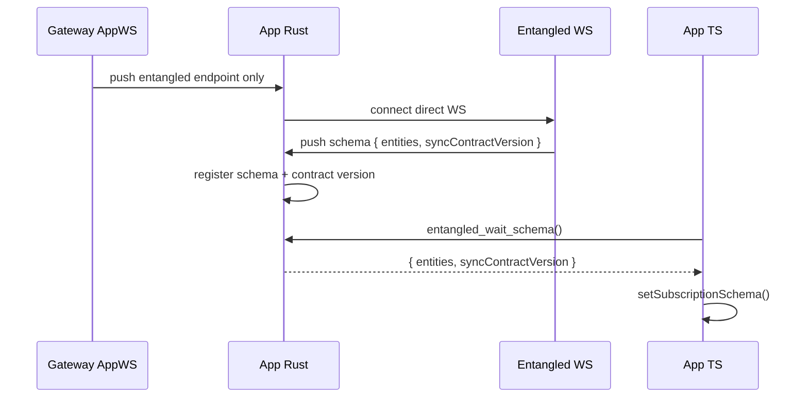

# Entangled Schema SSOT

Date: 2026-04-29

## Target

Entangled schema has exactly one live source:

1. Entangled server sends the first direct WS `push` frame with `event: "schema"`.
2. App Rust consumes that frame, registers the schema in `EntangledState`, and caches the advertised `syncContractVersion`.
3. App TS reads the registered schema from Rust and uses it for query keys, id fields, eager entity names, and type guardrails.

Gateway is not a schema authority. Gateway may only tell the App where the direct Entangled WS endpoint is.

## Non-Goals

- No Gateway REST schema endpoint.
- No Gateway AppWS schema payload.
- No TS fallback path to `/api/entangled/schema` or `/api/entangled-schema`.
- No hardcoded App id-field fallback such as `default_id_field_for_entity`.

## Runtime Flow

## Invariants

- App startup must never call Gateway REST for Entangled schema.
- Gateway AppWS must not serialize `entities` or `syncContractVersion` for Entangled schema.
- Entangled direct WS schema push is fail-fast: if schema never arrives, TS bootstrap fails with a schema timeout instead of falling back.
- Load-more cache writes require the schema-provided `idField`; missing `idField` is a contract error.
- Tests must catch reintroduction of REST schema routes, Gateway schema pushes, and hardcoded id-field fallback.

