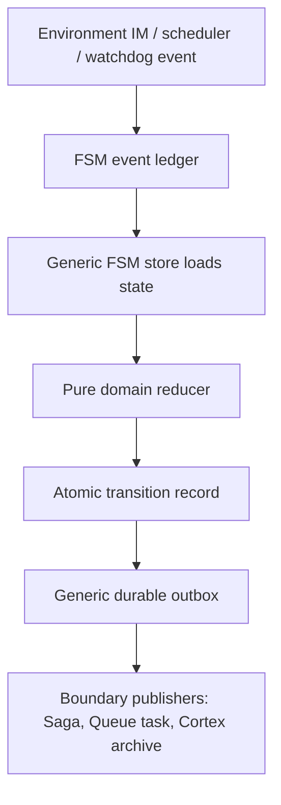

# Generic FSM Substrate

This document records the target model for replacing ad-hoc Queue session
coordination with a small reusable FSM substrate. The intent is not to make
agent behavior "smarter"; it is to make the harness state machine explicit,
replayable, and clean enough that old branches can be deleted.

## Principles

1. The agent is the subject. The harness coordinates environment events and
   tools around that subject; it does not infer personality or behavior.
2. User messages are environment input events. They are not special control
   shortcuts once they enter the harness.
3. Shell, Cortex, Queue, and IM are boundaries. The pure FSM must not read time,
   IDs, env, DB, network, files, or globals.
4. Generated code is cheap; stale branches and misleading residue are expensive.
   Every migration ticket must name the old code it deletes or retires.

## Minimal Model

```text
FsmState(machine_type, machine_id, state, generation, payload)
FsmEvent(event_id, event_type, payload, idempotency_key)
FsmDecision(action, next_state, effects, reason)
FsmEffect(effect_type, payload, idempotency_key)
```

The pure decision contract is:

```text
(state_snapshot, input_event, explicit_context) -> decision
```

The repository/runtime contract is:

```text
append event -> load state -> decide -> persist state/effects atomically
```

Outbox publishing is a separate boundary:

```text
pending durable effect -> publish -> ack/fail/dead-letter
```

## Target Layers



## Session Harness Mapping

| Generic concept | Session meaning |
|---|---|
| `machine_type` | `queue_session` |
| `machine_id` | `agent_id:subagent_id` |
| `state` | `no_active`, `starting`, `active`, `ending`, `suspected_dead`, `recovering` |
| `generation` | active wake generation |
| `InputEvent(user_message)` | append input, then attach or start wake |
| `InputEvent(session_finalized)` | close active generation with reason/stack |
| `Effect(create_wake_saga)` | durable saga creation outbox |
| `Effect(publish_attach_input)` | durable attach-input task publish |
| `Effect(recovery_archive_scope)` | durable Cortex archive request |

## Migration Tickets

1. **PR-258 Generic FSM pure core**: introduce a business-agnostic pure FSM
   core and migrate session dispatch decision through it.
2. **PR-259 Generic durable store/outbox**: extract session ledger/outbox table
   operations behind a generic store interface without adding business behavior.
3. **PR-260 Session harness cutover**: make dispatch/finalize/recovery use the
   generic store as the active path.
4. **PR-261 Residue deletion**: delete session-only ledger/outbox shells, stale
   dual-path helpers, and historical dual-path names after cutover tests pass.

## Non-Goals

- Do not add a workflow engine.
- Do not make LLM behavior part of the FSM.
- Do not make Cortex own Queue state.
- Do not keep both generic and session-specific active paths indefinitely.

## Acceptance Invariants

- Pure reducers are deterministic from explicit arguments.
- State mutation and durable effects commit in one transaction.
- Publishing side effects never happens inside the pure reducer.
- Attach/finalize effects carry generation.
- Watchdog produces events; it does not directly mutate state.
- Every retired path has a deletion ticket and a residue scan.
