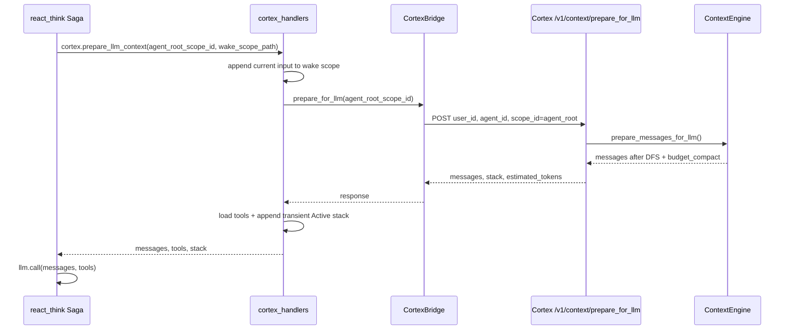

# Agent Runtime → Cortex 调用链（`cortex.prepare_llm_context`）

> 源码：`novaic-agent-runtime/task_queue/handlers/cortex_handlers.py`、`task_queue/utils/cortex_bridge.py`、`task_queue/sagas/react_think.py`；Cortex 侧：`novaic_cortex/api.py` 的 `context_prepare_for_llm` 与 `context_stack/engine.py`。

跨服务约定名是 topic **`cortex.prepare_llm_context`**。Cortex HTTP 实现是 **`POST /v1/context/prepare_for_llm`**。

## 1. Runtime 入口

`react_think.py` 的 `prepare_context` step 发布：

- `scope_id`：当前 wake scope id。
- `agent_root_scope_id`：长期 agent-root scope id。
- `wake_scope_path`：当前 wake scope 的真实路径。
- `user_id` / `agent_id` / `subagent_id`。

`handle_cortex_prepare_llm_context` 会优先用 `agent_root_scope_id` 作为 Cortex 渲染入口，所以历史 wake 会通过 agent-root DFS 自然出现。

## 2. CortexBridge

`CortexBridge.prepare_for_llm(scope_id)` 调：

```text
POST /v1/context/prepare_for_llm
{ user_id, agent_id, scope_id }
```

这里传入的 `scope_id` 是 agent-root id，而不是当前 wake id。

## 3. Cortex HTTP

`api.py::context_prepare_for_llm`：

1. `_get_workspace(user_id, agent_id)`
2. `scope_path = /ro/active/{agent_root_scope_id}`
3. `load_engine_config(ws)` → `engine_config_to_compact_config(...)`
4. `ContextEngine(workspace=ws, scope_path=scope_path, config=...)`
5. `prepare_messages_for_llm()`
6. `engine.status(messages)` 提取 active stack frames

返回：

```json
{
  "messages": [],
  "stack": [],
  "estimated_tokens": 0
}
```

## 4. Handler 拼最终 LLM 调用

`handle_cortex_prepare_llm_context`：

1. 将当前 IM 输入写入当前 wake scope。
2. 调 `bridge.prepare_for_llm(agent_root_scope_id)`。
3. 加载 builtin tools，并转成 OpenAI `tools[]`。
4. 根据 `stack` 追加瞬态 `[Active scope stack ...]` system message。
5. 如上一轮 assistant 没有 tool_calls，追加 `NO_TOOL_WARNING`，提醒 LLM 需要用 shell 中的 `agentctl im reply` 或 `skill_end` 这类真实动作推进。

这两类瞬态 system message 不写入 `context.jsonl`，每次 LLM 调用前重新生成。

## 5. Scope 生命周期 topic

| topic / handler | Cortex HTTP | 语义 |
| --- | --- | --- |
| `handle_cortex_skill_begin` | `/v1/context/skill_begin` | 在当前 active scope 下开子 skill scope |
| `handle_cortex_skill_end` | `/v1/context/skill_end` | 关闭当前 LIFO 栈顶 scope，`report` 写入该 scope 的 `summary.md` |
| `handle_cortex_check_stack` | `/v1/context/status` | 查询当前 active stack |
| `handle_cortex_scope_end` | `/v1/scope/end` | 结构性 cleanup；非空 report 被拒绝 |

当前 wake scope 也通过 `skill_end(report=...)` 由 LLM 关闭。栈清空后，`react_actions` 触发 `wake_finalize` 做结构性收尾；`wake_finalize` 不生成 summary。

## 6. 一览图



## 相关

- [http-api.md](http-api.md)
- [context-timeline-and-dfs.md](context-timeline-and-dfs.md)
- [scope-lifecycle.md](scope-lifecycle.md)
