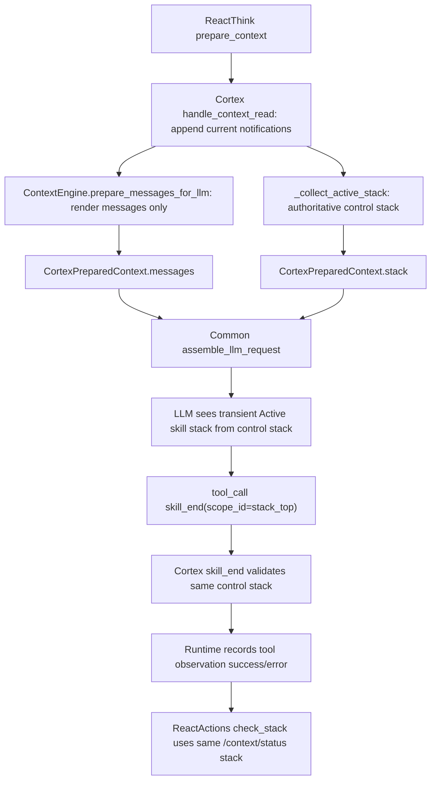

# Agent Loop 控制面一致性设计

本文定义 Agent Runtime、Cortex、Common LLM assembly 在 **Active skill stack / tool result / wake finalize** 上的控制面一致性目标。它不是事故复盘文档，而是后续实现 PR 的设计契约。

## 1. 背景

近期 Agent loop 出现过连续多轮 `skill_end` 失败：

- LLM prompt 中的 `[Active skill stack]` 指向 `cortex-skill-review-8ed21bdc`。
- Cortex `skill_end` 实际校验的栈顶是当前 wake scope。
- LLM 按 prompt 反复调用旧 `scope_id`，工具反复返回 scope mismatch。
- Runtime 没有把 `{"ok": false}` 识别为工具逻辑失败，也没有重复错误熔断。
- 最终依赖 `round_cap` 强制 `wake_finalize`，不是自然闭合。

这个现象的根因不是“LLM 重试错误”，而是控制面事实源分裂：

| 面向 | 当前来源 | 问题 |
|---|---|---|
| LLM 可见 Active skill stack | `ContextEngine.status().frames` | 来自 context render tree，可能包含不在 active path 上的 open scope |
| `skill_end` 校验栈顶 | Cortex `_collect_active_stack()` / `resolve_active_scope_path()` | 真实控制栈 |
| Runtime finalize 决策 | `CORTEX_CHECK_STACK` / `/v1/context/status` | 真实控制栈，但与 prompt stack 可能不一致 |
| 工具结果成功判断 | Runtime `_executor_success()` | 只认 `success:false`，不认 `ok:false` |

## 2. 目标

1. **控制栈单一真相源**：LLM prompt、`skill_end`、`check_stack`、finalize 决策必须使用同一个 authoritative stack snapshot。
2. **ContextEngine 只负责渲染**：它可以提供 messages、folded summaries、token 信息，但不能产出可执行控制指令。
3. **工具失败语义统一**：`success:false`、`ok:false`、异常、业务校验失败都必须进入统一 error observation。
4. **重复错误必须收敛**：同一个工具错误不能重复到 round cap；必须在短阈值内进入 correction / recovery / forced finalize。
5. **round cap 只做事故刹车**：不伪装成 `stack_empty=true`，必须明确记录 `force_finalize_reason=round_cap`。

## 3. 非目标

- 不改变 `skill_begin` / `skill_end` 的 LIFO 语义。
- 不引入 LLM 可调用的 `finalize` / `rest` 工具。
- 不让 Runtime 从 `im_reply`、聊天内容或 summary 文本推断 scope 状态。
- 不让 Business 或 Entangled 参与 Cortex scope 控制栈判定。

## 4. 核心不变量

### INV-A · 控制栈 SSOT

任何用于控制行为的 stack 必须来自 Cortex active path：

```text
_collect_active_stack(root_scope)
  -> resolve_active_scope_path(root_scope)
  -> current stack_top
```

适用范围：

- `/v1/context/status`
- `/v1/context/skill_begin`
- `/v1/context/skill_end`
- `/v1/context/prepare_for_llm` 返回给 Runtime 的 `stack`
- Common `format_active_skill_stack_message()`
- Runtime `react_actions` finalize decision

### INV-B · 渲染栈不是控制栈

`ContextEngine.status().frames` 只能作为 render diagnostics：

- `messages` 拼装、fold、token 估算可以继续走 ContextEngine。
- `frames` 不得再作为 `[Active skill stack]` 的数据源。
- 如果 render open scopes 与 active path stack 不一致，只能打 drift log / metric，不能影响 LLM 指令。

### INV-C · 工具逻辑失败必须显式失败

任何工具结果满足以下之一，都必须记录为 `tool_success=false`：

- `result.success is false`
- `result.ok is false`
- executor 抛异常
- Cortex business validation 失败，如 `scope_mismatch`

Queue task 可以是 completed，表示“工具调用执行流程完成”；但 tool observation 必须是 error，不能把业务失败包装成 completed success。

### INV-D · 重复同错熔断

同一个 wake 内，同一类工具错误的 fingerprint 连续出现超过阈值时，必须退出普通 think loop。

建议 fingerprint：

```json
{
  "tool_name": "skill_end",
  "error_code": "scope_mismatch",
  "requested_scope_id": "...",
  "actual_stack_top": "..."
}
```

默认阈值：2 次。

### INV-E · 强制 finalize 不等于 stack empty

`round_cap`、`repeated_scope_mismatch`、`dead_active_session_recovery` 等强制收口必须显式记录原因：

```json
{
  "should_finalize": true,
  "stack_empty": false,
  "force_finalize_reason": "round_cap",
  "stack_depth_at_finalize": 1
}
```

## 5. 目标架构



关键点：`F` 和 `J` 必须同源。只要 LLM 看到的 `stack_top` 与工具校验的 `stack_top` 同源，就不会出现“系统提示 A、工具验 B”的结构性分裂。

## 6. 技术改动点

### 6.1 Cortex `prepare_for_llm` 使用 authoritative stack

文件：

- `novaic-cortex/novaic_cortex/api.py`
- `novaic-cortex/novaic_cortex/context_stack/engine.py`

改动：

1. `context_prepare_for_llm()` 继续用 `ContextEngine.prepare_messages_for_llm()` 生成 messages。
2. `stack` 改为 `_collect_active_stack(ws, root_path)`。
3. `estimated_tokens`、`total_messages` 仍可来自 `ContextEngine.status(messages)`。
4. `ContextEngine.status().frames` 改名或注释为 render-only diagnostic，避免误用。

验收：

- `/v1/context/prepare_for_llm` 返回的 `stack` 与 `/v1/context/status.frames` 一致。
- Common assembly 的 `[Active skill stack]` 只由该 `stack` 渲染。

### 6.2 Stack drift 观测

文件：

- `novaic-cortex/novaic_cortex/api.py`
- `novaic-cortex/novaic_cortex/observability.py`

改动：

1. 在 `prepare_for_llm` 中同时计算：
   - `control_stack = _collect_active_stack(...)`
   - `render_stack = ContextEngine.status(messages).frames`
2. 如果二者不一致：
   - 不阻断请求。
   - LLM prompt 继续使用 `control_stack`。
   - 记录结构化日志：

```text
event=stack_drift_detected
root_scope_id=...
control_stack_top=...
render_stack_top=...
render_open_scope_count=...
```

3. 指标：
   - `cortex_stack_drift_total`

验收：

- drift 不再污染 prompt。
- 生产可以通过日志与指标定位 orphan open scope。

### 6.3 工具失败语义统一

文件：

- `novaic-agent-runtime/task_queue/handlers/tool_handlers.py`
- `novaic-agent-runtime/task_queue/contracts/react_actions.py`

改动：

```python
def _executor_success(result) -> bool:
    if not isinstance(result, dict):
        return True
    if result.get("success") is False:
        return False
    if result.get("ok") is False:
        return False
    return True
```

保存 tool step 时：

- `tool_success=false`
- `tool_status="error"`
- `status="error"` 或至少 observation status 为 error
- `error_code`、`error`、`actual_stack_top` 保留在 content / observation 中

验收：

- `skill_end` 返回 `ok:false` 时，下一轮 LLM 看到的是 error observation。
- 不再出现 `ok:false` 但 tool projection 显示 completed 的状态。

### 6.4 `skill_end` mismatch 结构化返回

文件：

- `novaic-cortex/novaic_cortex/api.py`
- `novaic-agent-runtime/task_queue/utils/cortex_bridge.py`
- `novaic-agent-runtime/task_queue/handlers/tool_handlers.py`

改动：

`/v1/context/skill_end` 在 LIFO mismatch 时返回：

```json
{
  "ok": false,
  "error_code": "scope_mismatch",
  "error": "scope_id mismatch...",
  "requested_scope_id": "cortex-skill-review-8ed21bdc",
  "actual_stack_top": "03161b28-1d47-4f17-a0b6-328de1d2e327",
  "stack": [...],
  "stack_depth": 1
}
```

Runtime 不把这些字段吞掉，原样进入 tool observation。

验收：

- UI / activity timeline / Cortex step payload 能看到 error_code 与 actual_stack_top。
- 下一轮 prompt 能从最近 tool result 明确得知“不要重试旧 scope_id”。

### 6.5 重复错误熔断

文件：

- `novaic-agent-runtime/task_queue/contracts/react_actions.py`
- `novaic-agent-runtime/task_queue/sagas/react_actions.py`
- `novaic-agent-runtime/queue_service/saga_repo.py`

改动：

1. 在 saga context 中维护：

```json
{
  "last_tool_error_fingerprint": "...",
  "same_tool_error_count": 2
}
```

2. fingerprint 连续达到阈值时，进入 recovery 分支：
   - 重新读取 `/v1/context/status`
   - 注入 corrective system note，或直接 forced finalize
   - `force_finalize_reason="repeated_scope_mismatch"`

3. 不等待 `round_cap`。

验收：

- 同一个 `skill_end scope_mismatch` 最多重复 2 轮。
- 第 3 次之前必须进入 recovery / finalize。

### 6.6 Round cap 语义修正

文件：

- `novaic-agent-runtime/task_queue/contracts/react_actions.py`
- `novaic-agent-runtime/task_queue/sagas/react_actions.py`
- `novaic-agent-runtime/task_queue/sagas/wake_finalize.py`

改动：

当前 `round_cap` 返回 `stack_empty=true`，应改为：

```json
{
  "should_finalize": true,
  "stack_empty": false,
  "force_finalize_reason": "round_cap",
  "stack_depth": 1,
  "round_num": 40
}
```

如果现有 SagaDefinition 只认 `stack_empty` 作为 finalize 条件，则新增显式字段：

- `should_finalize`
- `should_continue`

避免把“强制收口”伪装成“栈空”。

验收：

- 日志、metrics、finalize context 均能区分 natural finalize 与 forced finalize。
- `round_cap` 不再污染 stack-empty 指标。

### 6.7 Transient prompt message 防持久污染

文件：

- `novaic-common/common/contracts/llm_assembly.py`
- `novaic-agent-runtime/common/contracts/llm_assembly.py`
- `novaic-cortex/novaic_cortex/context_stack/engine.py`

改动：

`format_active_skill_stack_message()` 生成的 message 加 metadata：

```json
{
  "role": "system",
  "content": "[Active skill stack...]",
  "_metadata": {
    "skill_stack_snapshot": true,
    "transient": true,
    "source": "control_stack"
  }
}
```

ContextEngine prepare 时过滤掉已持久化的旧 stack snapshot：

- 如果 `context.jsonl` 中出现 `_metadata.skill_stack_snapshot=true`
- 或 content 以 `[Active skill stack` 开头
- 不进入最终 messages

验收：

- 每轮最多一个 Active skill stack system message。
- 它永远位于 assembly 阶段末尾，由最新 control stack 生成。

### 6.8 Orphan open scope scanner / repair

文件：

- `novaic-cortex/novaic_cortex/workspace.py`
- `novaic-cortex/novaic_cortex/api.py`
- `novaic-agent-runtime/task_queue/workers/health_worker.py`

改动：

1. Cortex 增加只读 scanner：
   - 遍历 root 下所有 open scope。
   - 计算 active path。
   - 不在 active path 上的 open scope 标记为 orphan。

2. 初期只 report：

```json
{
  "orphan_open_scopes": [
    {"scope_id": "...", "path": "...", "parent": "..."}
  ]
}
```

3. 后续由 repair endpoint 或 health worker 归档：

```text
Auto-archived by Cortex control-plane repair: orphan open scope not on active path.
```

验收：

- 正常 active root 下 `orphan_open_scope_count=0`。
- repair 不影响 active path 上的 current wake / child skill。

## 7. 数据与状态字段

### 7.1 Stack frame contract

统一 frame 结构：

```json
{
  "depth": 0,
  "scope_id": "wake-current",
  "skill_name": "wake",
  "scope_path": "/ro/active/agent-root-main/steps/0001_scope_wake-current",
  "source": "active_path"
}
```

排序建议：root child -> top，即 prompt 展示顺序与 `depth` 一致。栈顶取最后一个 frame。

### 7.2 Tool error observation

```json
{
  "kind": "tool_result",
  "tool": "skill_end",
  "status": "error",
  "success": false,
  "error_code": "scope_mismatch",
  "requested_scope_id": "cortex-skill-review-8ed21bdc",
  "actual_stack_top": "03161b28-1d47-4f17-a0b6-328de1d2e327",
  "summary": "scope_id mismatch..."
}
```

### 7.3 Finalize decision

```json
{
  "should_finalize": true,
  "stack_empty": false,
  "force_finalize_reason": "repeated_scope_mismatch",
  "stack_depth_at_finalize": 1,
  "round_num": 23
}
```

## 8. 测试计划

### Cortex

- `test_prepare_for_llm_stack_matches_context_status`
- `test_prepare_for_llm_uses_control_stack_when_render_stack_drifts`
- `test_context_status_and_skill_end_share_same_stack_top`
- `test_orphan_open_scope_does_not_enter_active_skill_stack`
- `test_active_stack_frame_order_contract`

### Runtime

- `test_ok_false_tool_result_marks_tool_error`
- `test_skill_end_scope_mismatch_records_error_observation`
- `test_repeated_scope_mismatch_breaks_before_round_cap`
- `test_round_cap_does_not_report_stack_empty`
- `test_forced_finalize_records_reason_and_stack_depth`

### Common assembly

- `test_active_stack_snapshot_has_transient_metadata`
- `test_persisted_active_stack_snapshot_is_filtered`
- `test_stack_message_uses_last_frame_as_top`

### Integration

构造流程：

1. 创建 agent-root + wake。
2. 创建 child skill。
3. 人为制造 render tree open scope 与 active path drift。
4. 调 `prepare_for_llm`。
5. 断言 LLM stack 使用 active path。
6. 让 LLM 模拟调用旧 scope `skill_end`。
7. 断言 tool observation 是 error。
8. 连续两次后触发 recovery / forced finalize，而不是跑到 round cap。

## 9. 观测指标

| 指标 | 目标 |
|---|---|
| `cortex_stack_drift_total` | 正常路径为 0 |
| `tool_logical_failure_as_success_total` | 必须为 0 |
| `skill_end_scope_mismatch_total` | 不持续增长 |
| `agent_loop_repeated_tool_error_total` | 只在异常恢复场景出现 |
| `turn_finalizer_total{reason="round_cap"}` | 正常用户路径接近 0 |
| `cortex_orphan_open_scope_total` | 正常路径为 0 |
| `cortex_orphan_scope_repaired_total` | 只在 repair 场景出现 |

## 10. 实施顺序

1. PR-A：Cortex `prepare_for_llm` stack 改为 `_collect_active_stack`，并加 drift log。
2. PR-B：Runtime `_executor_success` 识别 `ok:false`，tool observation 统一 error。
3. PR-C：`skill_end` mismatch 结构化返回。
4. PR-D：重复工具错误熔断与 recovery / forced finalize。
5. PR-E：round cap 语义修正，不再伪装 stack empty。
6. PR-F：Active stack transient metadata + persisted snapshot 过滤。
7. PR-G：orphan open scope scanner / repair。

## 11. 回滚策略

- PR-A 可通过配置开关临时回退到旧 stack source，但默认必须使用 control stack。
- PR-B 不建议回滚；若回滚会恢复 `ok:false` 假成功风险。
- PR-D 可先以 observe-only 模式上线，只打重复错误指标，不强制 finalize。
- PR-G 初期必须 report-only，上线观察后再开启 auto repair。

## 12. 完成定义

本设计完成时必须满足：

1. LLM prompt 中的 Active skill stack 与 `/v1/context/status.frames` 完全一致。
2. `skill_end` mismatch 在 Cortex step 中显示为 error observation。
3. 同一 scope mismatch 不会重复超过阈值。
4. `round_cap` 不再被统计为 natural stack-empty finalize。
5. 测试覆盖 Cortex / Runtime / Common assembly 三层。
6. 生产可通过指标判断是否存在 stack drift、orphan open scope、重复工具错误。

