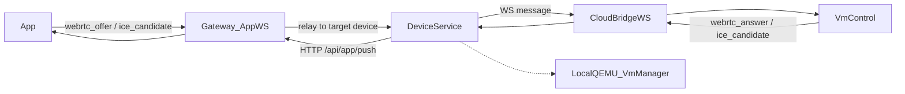

# CloudBridge / VmControl / Device Service 硬切方案

> 状态：**已执行完成**  
> 更新：2026-04-15  
> 适用范围：`novaic-app`、`novaic-device`、`novaic-gateway`、父仓 `docs/`

## 1. 目标与结论

本文档定义一次**不保留向后兼容**的 CloudBridge / VmControl / Device Service 硬切方案。

目标不是“继续修补旧桥”，而是把 VM / 设备远程控制架构彻底收敛到下面这条边界：

- `Gateway` 只负责 **App-facing signaling / auth / TURN 凭证生成 / 用户侧 fanout**
- `Device Service` 只负责 **device registry / northbound 设备 API / CloudBridge broker**
- `VmControl` 是 **唯一 runtime owner**，负责 VM / WebRTC / 输入控制 / 截图等全部执行
- `CloudBridge` 是 **typed WebSocket protocol**，不再承载 `proxy_request / proxy_response`
- `Device Service` **不再启动、恢复、关闭任何本地 QEMU 进程**
- `VNC` 路径视为历史包袱，直接删除；远程控制统一认 `WebRTC`

这是一次**职责硬切**，不是“平滑迁移”。

## 2. 为什么要硬切

当前代码已经完成了一半物理拓扑切分，但逻辑边界仍处于混沌状态：

- `VmControl` 已优先通过 `Device Service` 的 `/internal/pc/ws` 建立 CloudBridge 连接
- App WebRTC 信令已走 `App -> Gateway -> Device -> WS -> VmControl`
- 但 `Device Service` 仍保留本地 QEMU runtime（`VmManager`）与生命周期调用
- `pc_client.py` 与 `cloud_bridge.rs` 之间仍使用 `HTTP-over-WS` 的 `proxy_request / proxy_response`
- VNC 路由与 `restart_vnc` action 仍保留，制造错误的执行面认知
- 多处代码和文档仍保留 `Gateway` 是 PC Bridge 所有者的过时叙事

结果是：

- 连接层已经切到 `Device Service`
- 执行层却仍然双轨
- 协议层仍然是“把 HTTP 打包塞进 WS”
- 文档与边界难以自证一致

## 3. 当前架构现状

### 3.1 当前主链路



### 3.2 当前代码归属

| 面向 | 当前文件 | 当前问题 |
|------|---------|---------|
| App 信令入口 | `novaic-gateway/gateway/api/app_client.py` | 边界基本合理，可保留 |
| CloudBridge WS 服务端 | `novaic-device/device/pc_client.py` | 仍是 `proxy_request` 模式，且留有 legacy fallback |
| Device northbound VM API | `novaic-device/device/vm_routes.py`、`device/vmcontrol_routes.py`、`device/agent_vm_proxy.py`、`device/gateway_facing_api.py` | 调用风格混乱，部分仍依赖 VNC / 本地 runtime 叙事 |
| 本地执行面 | `novaic-device/device/vm/manager.py`、`device/vm/*` | 应彻底删除 |
| CloudBridge WS 客户端 | `novaic-app/src-tauri/vmcontrol/src/cloud_bridge.rs` | 仍兼容 `gateway_url` fallback，仍带 `proxy_request` |
| WebRTC 执行面 | `novaic-app/src-tauri/vmcontrol/src/*` | 保留，作为唯一 runtime owner |

### 3.3 当前最核心的设计缺陷

#### 缺陷 A：连接边界与执行边界不一致

`VmControl` 已连接 `Device Service`，但 `Device Service` 启动时仍会：

- `recover_processes()`
- `stop_all()`

这意味着“设备路由层”仍自认为拥有 VM 执行生命周期。

#### 缺陷 B：协议层泄漏 HTTP 语义

当前 `pc_client.py` / `cloud_bridge.rs` 之间的交互仍然是：

- `proxy_request { method, path, body, headers }`
- `proxy_response { status, body }`

这导致：

- Device 与 VmControl 的边界在代码层面不清晰
- VmControl 仍被迫维护一套“像 HTTP server 一样”的 Router 适配面
- 路由重构时容易把本地 REST 路径与远程桥协议耦在一起

#### 缺陷 C：VNC 与 WebRTC 双叙事并存

虽然远程控制实际已全面转向 WebRTC，但代码里仍残留：

- `/api/vmcontrol/vms/{vm_id}/vnc`
- `vnc_url`
- `restart_vnc`
- VNC 状态与本地 `ws://127.0.0.1:19996/...` 假设

这会误导后续实现者继续围绕 VNC 构建功能。

## 4. 目标架构

### 4.1 最终边界


### 4.2 明确职责

#### Gateway

- 维护 `/api/app/ws`
- 校验 App JWT
- 生成并注入 TURN 凭证
- 将 `webrtc_offer` / `ice_candidate` 转发给目标 `Device Service`
- 接收来自 `Device Service` 的 `webrtc_answer` / `ice_candidate` 回推，并 fanout 给 App
- 不拥有 VM runtime
- 不拥有 CloudBridge WS
- 不理解 vmcontrol 的内部 HTTP path

#### Device Service

- 维护 `/internal/pc/ws`
- 管理 `device_id -> websocket -> user_id` 的 registry
- 将 northbound 设备操作转换为**typed command**
- 将来自 `VmControl` 的 typed result / event 路由到 Gateway 或实体层
- 管理 `devices` 实体与 `pc_client_id` 绑定关系
- 不再启动本地 VM
- 不再承担 VNC 中转

#### VmControl

- 维护与 `Device Service` 的唯一 CloudBridge 长连接
- 作为唯一 runtime owner 执行：
  - VM list / get / start / stop / restart
  - screenshot
  - keyboard / mouse input
  - WebRTC start / stop
  - ICE candidate 处理
- 不再充当“本地 HTTP server 被远端代理”的角色

## 5. 非目标

以下事项不在本轮硬切范围内：

- 不调整 App 与 Gateway 之间的 `/api/app/ws` 总体边界
- 不迁移 TURN 生成逻辑出 Gateway
- 不重构前端 WebRTC UI
- 不在本轮引入新的中间层或兼容 facade
- 不保留 `proxy_request` 作为 fallback
- 不保留 VNC 作为备用通路

## 6. 协议重设计

## 6.1 设计原则

- **显式类型化**：每个命令 / 事件都必须有固定 `type`
- **单职责消息**：每个 WS 消息表达一个业务语义，而不是一个通用 HTTP 包
- **请求-响应关联**：保留 `request_id`
- **错误显式化**：统一 `command_error`
- **禁止路径透传**：协议中不再出现 `path` / `method`
- **northbound 与 bridge 解耦**：REST API 可以变化，但 CloudBridge 协议不泄漏 REST 细节

## 6.2 消息模型

### 6.2.1 Device Service -> VmControl 命令

```json
{ "type": "vm_list", "request_id": "uuid" }
{ "type": "vm_get", "request_id": "uuid", "vm_id": "agent-1" }
{ "type": "vm_start", "request_id": "uuid", "vm_id": "agent-1", "payload": { ... } }
{ "type": "vm_stop", "request_id": "uuid", "vm_id": "agent-1", "payload": { ... } }
{ "type": "vm_restart", "request_id": "uuid", "vm_id": "agent-1", "payload": { ... } }
{ "type": "vm_screenshot", "request_id": "uuid", "vm_id": "agent-1" }
{ "type": "vm_input_keys", "request_id": "uuid", "vm_id": "agent-1", "payload": { ... } }
{ "type": "vm_input_mouse_move", "request_id": "uuid", "vm_id": "agent-1", "payload": { ... } }
{ "type": "vm_input_mouse_click", "request_id": "uuid", "vm_id": "agent-1", "payload": { ... } }
{ "type": "webrtc_offer", "device_id": "dev-1", "session_id": "sess-1", "sdp_offer": "..." }
{ "type": "webrtc_stop", "device_id": "dev-1", "session_id": "sess-1" }
{ "type": "sync_devices", "devices": [ ... ] }
```

### 6.2.2 VmControl -> Device Service 结果 / 事件

```json
{ "type": "command_result", "request_id": "uuid", "ok": true, "result": { ... } }
{ "type": "command_error", "request_id": "uuid", "error": { "code": "vm_not_found", "message": "..." } }
{ "type": "webrtc_answer", "device_id": "dev-1", "session_id": "sess-1", "sdp_answer": "..." }
{ "type": "ice_candidate", "device_id": "dev-1", "session_id": "sess-1", "candidate": { ... } }
{ "type": "vm_status_report", "vm_ids": [ ... ], "android_serials": [ ... ], "android_avd_names": [ ... ] }
{ "type": "ping" }
{ "type": "pong" }
```

## 6.3 协议约束

- `command_result` 与 `command_error` 必须二选一
- 除 signaling 类事件外，所有有返回值的命令必须带 `request_id`
- `webrtc_offer` / `webrtc_answer` / `ice_candidate` 为异步事件，不强制 `request_id`
- `sync_devices` 为 Device Service 下发的控制面快照
- `vm_status_report` 为 VmControl 上报的运行时快照

## 7. 代码重构设计

## 7.1 `novaic-device` 设计

### 7.1.1 `device/pc_client.py`

目标：从“HTTP proxy manager”改造成“typed bridge broker”。

必须完成的改造：

- 删除 `forward_to_device()`
- 删除 `_DeviceManagerAdapter.forward_request()`
- 引入统一方法，例如：
  - `send_command(device, command_type, payload, timeout=...)`
  - `await_command_result(...)`
- `_handle_device_message()` 改为只处理：
  - `command_result`
  - `command_error`
  - `webrtc_answer`
  - `ice_candidate`
  - `vm_status_report`
  - `ping/pong`
- 删除以下兼容逻辑：
  - `legacy-*` device id fallback
  - `user_id="local"` fallback
  - “连接到 Gateway”相关旧文案

### 7.1.2 `main_device.py`

必须完成：

- 删除 `recover_processes()`
- 删除 shutdown `stop_all()`
- 删除 `device.vm` 本地 runtime 初始化依赖
- 文案改为：
  - `Device Service = PC bridge + device routing + vmcontrol command broker`

### 7.1.3 `device/vm_routes.py`

必须完成：

- 所有 VM REST API 从 `forward_request(method, path, ...)` 改为 typed command 调用
- 删除 `vnc_url`
- 删除 `/vnc/status/{agent_id}`
- 返回结构中不再出现 VNC 相关字段
- 所有“本地 localhost vmcontrol”叙事改成“remote vmcontrol runtime”

### 7.1.4 `device/vmcontrol_routes.py`

必须完成：

- 删除 `/vms/{vm_id}/vnc` WS 代理
- 删除所有 VNC 直连 `ws://127.0.0.1:19996/...` 假设
- 保留 REST northbound API 时，也要改为 typed command broker
- 若 `vmcontrol_routes.py` 的剩余职责和 `vm_routes.py` 重叠，允许合并或直接删掉整个文件

### 7.1.5 `device/gateway_facing_api.py`

必须完成：

- 对 Gateway 暴露的内部设备 API 改为 typed bridge 调用
- 删掉任何 VNC / 本地 runtime 相关健康叙事

### 7.1.6 `device/agent_vm_proxy.py`

必须完成：

- 所有 `/api/vmuse`、`/api/android`、`/api/hd` 透传链路重新审视是否仍需 path-based proxy
- 若短期保留 HTTP path 风格，只允许存在于 `Device Service -> VmControl` 的**本地 adapter 层**
- CloudBridge 协议本身不得再透出通用 `path`

### 7.1.7 `device/vm/*`

必须完成：

- 删除 `device/vm/manager.py`
- 删除 `device/vm/repository.py`
- 删除 `device/vm/setup.py`
- 删除 `device/vm/ssh.py`
- 删除 `device/vm/deployer.py`
- 删除本地 QEMU 专属辅助逻辑
- 如其中仍有“端侧仍需保留”的纯数据结构，需搬迁到非 `vm/` 目录，避免继续暗示本地 runtime

### 7.1.8 `device/vm_user_actions.py`

必须完成：

- 删除 `restart_vnc_action`
- 删除相应 action 暴露

### 7.1.9 `device/schema_push.py`

必须完成：

- 删除 `vm-users.restart_vnc`
- 重新审查 `devices` / `vm-users` action 列表，使其与 WebRTC-only 现实一致

## 7.2 `novaic-app` / `vmcontrol` 设计

### 7.2.1 `vmcontrol/src/cloud_bridge.rs`

必须完成：

- 删除 `proxy_request`
- 删除 `proxy_response`
- 删除 `gateway_url` fallback
- `CloudBridgeConfig` 改为强依赖 `device_url`
- 收到 typed command 后直接调用内部执行函数，而不是拼装 HTTP request + `Router::oneshot()`

### 7.2.2 命令分发层

需要新增明确的命令分发模块，例如：

- `handle_vm_list`
- `handle_vm_get`
- `handle_vm_start`
- `handle_vm_stop`
- `handle_vm_restart`
- `handle_vm_screenshot`
- `handle_vm_input_keys`
- `handle_vm_input_mouse_move`
- `handle_vm_input_mouse_click`
- `handle_webrtc_offer`
- `handle_webrtc_stop`

如果底层执行代码当前只暴露 HTTP handler，则应抽出共享 service 层，再让：

- 本地 HTTP API 使用这层 service
- CloudBridge typed command 也使用这层 service

不能继续让 WS 协议依赖 HTTP 路由语义。

### 7.2.3 WebRTC 路径

必须完成：

- `webrtc_offer` / `webrtc_answer` / `ice_candidate` 保持 typed event 模式
- 明确 WebRTC 是唯一远程视频控制面
- 删除任何 CloudBridge / 注释 / 文案中的 VNC 主路径描述

## 7.3 `novaic-gateway` 设计

### 7.3.1 `gateway/api/app_client.py`

本轮保留 Gateway 作为 App signaling owner，但要收敛职责：

- 保留 `/api/app/ws`
- 保留 `webrtc_offer` / `ice_candidate` 接收
- 保留 TURN 凭证注入
- 保留 `/api/app/push`
- 删除任何“Gateway 自己拥有 CloudBridge”或“Gateway 拥有 PC bridge”叙事

Gateway 不需要理解 typed bridge command 的细节，只负责：

- 找到目标 `device_id`
- 把 signaling 请求交给 Device Service

## 8. 需要删除的历史能力

以下内容明确列为**应删除**：

- `proxy_request`
- `proxy_response`
- `gateway_url` fallback（VmControl -> Gateway）
- `legacy-*` device id fallback
- `user_id="local"` fallback
- `VmManager`
- `recover_processes()`
- `stop_all()`
- `/api/vmcontrol/vms/{vm_id}/vnc`
- `vnc_url`
- `restart_vnc`
- 任何“高带宽视频流不走 CloudBridge，所以 Device 直连 localhost vmcontrol”的设计描述

## 9. 仓库级执行清单

## 9.1 `novaic-device` checklist

- [x] 删除 `device/vm/` 本地 runtime 目录或完成彻底瘦身后物理删除
- [x] 删除 `main_device.py` 中 `recover_processes()`
- [x] 删除 `main_device.py` 中 shutdown `stop_all()`
- [x] 重写 `pc_client.py` 为 typed command broker
- [x] 删除 `forward_request` / `forward_to_device` 旧接口
- [x] 删除 `legacy device_id` fallback
- [x] 删除 `local user_id` fallback
- [x] 删除 `vmcontrol_routes.py` 中 VNC WS proxy
- [x] 删除 `vm_routes.py` 中 `vnc_url`
- [x] 删除 `/vnc/status/*`
- [x] 删除 `vm_user_actions.py::restart_vnc_action`
- [x] 删除 `schema_push.py` 中 `vm-users.restart_vnc`
- [x] 清理 `gateway_facing_api.py`
- [x] 清理 `agent_vm_proxy.py`
- [x] 清理所有“Gateway owns pc bridge”文案

## 9.2 `novaic-app` checklist

- [x] 删除 `cloud_bridge.rs` 中 `proxy_request/proxy_response`
- [x] 删除 `gateway_url` fallback
- [x] `CloudBridgeConfig` 改为 `device_url` required
- [x] 新增 typed command dispatcher
- [x] 将本地 HTTP handler 复用的执行逻辑抽成 service 层（如当前仍绑在 axum route）
- [x] 清理 VNC 主路径叙事
- [ ] 确认 `webrtc_offer / answer / ice_candidate` 仍正常流转（需运行时验证）

## 9.3 `novaic-gateway` checklist

- [x] 保留 `/api/app/ws`
- [x] 保留 TURN 注入
- [x] 保留 `/api/app/push`
- [x] 清理旧 CloudBridge / Gateway owning bridge 叙事
- [x] 确认 Gateway 只与 Device Service 交互，不触碰 vmcontrol 内部 path

## 9.4 父仓文档 checklist

- [x] 更新 `docs/architecture/attention-points.md` 第 15 条
- [x] 更新 `docs/gateway/cloudbridge-vm.md`
- [x] 更新 `docs/gateway/README.md`
- [x] 更新 `docs/architecture/overview.md`
- [x] 更新 `docs/architecture/service-topology.md`
- [x] 更新 `docs/vmcontrol-architecture.md`
- [x] 更新相关 runbook 中的 VM / CloudBridge 拓扑描述（已检查，无旧叙事）

## 10. 建议实施顺序

虽然是硬切，但执行顺序仍应有明确层次，避免同时失去定位能力。

### Phase 1：删历史执行面

- 删除 `VmManager`
- 删除 Device startup/shutdown 中的本地 VM 生命周期
- 删除 VNC 路径
- 删除 `restart_vnc`

目标：先让代码库不再暗示“Device Service 可以本地跑 VM”。

### Phase 2：定义 typed bridge 协议

- 在 `novaic-device` 与 `novaic-app` 统一消息类型
- 明确 request/result/error 结构
- 替换 `proxy_request/proxy_response`

目标：让 CloudBridge 成为真正的 domain protocol，而不是 HTTP tunnel。

### Phase 3：改 northbound API 调用面

- `vm_routes.py`
- `vmcontrol_routes.py`
- `gateway_facing_api.py`
- `agent_vm_proxy.py`

目标：所有设备操作都通过 typed command broker 进入 VmControl。

### Phase 4：回收文档与死代码

- 更新文档
- 清理旧注释、兼容分支、无效模型字段
- 做全链路验收

## 11. 验收标准

满足以下条件，才算硬切完成：

- `Device Service` 启动与关闭不再触碰本地 VM 进程
- 代码库中不存在 `proxy_request` / `proxy_response`
- 代码库中不存在 `/vnc` 远程控制主路径
- 代码库中不存在 `restart_vnc`
- `VmControl` 连接只指向 `Device Service`
- App WebRTC 主链路可用：
  - App 发起 offer
  - Gateway 注入 TURN
  - Device Service 路由到目标设备
  - VmControl 返回 answer
  - ICE 双向传递成功
- 设备控制链路可用：
  - list
  - get
  - start
  - stop
  - restart
  - screenshot
  - keyboard/mouse input
- 文档中不再声称：
  - Gateway 拥有 CloudBridge WS
  - Device Service 本地跑 QEMU 是线上主路径
  - VNC 是主视频通路

## 12. 测试清单

## 12.1 静态检查

- [x] Python 语法检查通过（15 个文件 py_compile 全部 OK）
- [x] Rust 编译通过（`cargo check --package vmcontrol` 0 errors）
- [x] 受影响的 TypeScript / 前端接口类型同步（前端无 vnc_url/restart_vnc/proxy_request 引用）
- [x] `rg` 确认无 `proxy_request` / `proxy_response` 残留
- [x] `rg` 确认无 `restart_vnc` 残留
- [x] `rg` 确认无 `/vnc` 作为主远程控制路径残留

## 12.2 功能检查

- [ ] App 登录后 `VmControl` 能连上 `Device Service /internal/pc/ws`
- [ ] `vm_status_report` 能正确更新 `devices.pc_client_id`
- [ ] App 发起 WebRTC 会话成功
- [ ] WebRTC answer 回推到 App 成功
- [ ] ICE candidate 双向成功
- [ ] 断线重连后 `device_id` 仍能恢复状态
- [ ] VM start / stop / restart / screenshot / input 正常

## 12.3 负面检查

- [ ] 无 `x-device-id` 的连接被拒绝
- [ ] 无 `x-user-id` 的连接被拒绝
- [ ] 错误 `device_id` 不会串到其他用户设备
- [ ] Device Service 重启不会试图恢复本地 QEMU
- [ ] 云端部署中不再要求 `127.0.0.1:19996` 共机假设

## 13. 主要风险

### 风险 1：VmControl 内部执行逻辑目前仍大量附着在 HTTP handler

应对：

- 优先抽出 service 层
- 不允许把 typed command 再次转译成内部伪 HTTP path

### 风险 2：`agent_vm_proxy.py` 等路径可能继续泄漏“通用 path 代理”

应对：

- 本轮至少要求 CloudBridge 协议 typed 化
- 如果 northbound 仍需 path 风格，可先留在 Device Service 本地适配层，但不得下沉到 WS 协议

### 风险 3：文档与拓扑二次漂移

应对：

- 本文档 checklist 中的文档回收为必做项，不允许“代码先切、文档以后再补”

## 14. 执行完成后的文档状态

执行完成后，文档应该统一表达为：

- CloudBridge WS 所有者是 `Device Service`
- App 信令 owner 是 `Gateway`
- WebRTC 是唯一远程控制视频面
- `VmControl` 是唯一 runtime owner
- `Device Service` 不运行本地 QEMU

## 15. 最终一句话定义

**App 通过 Gateway 发起信令，Device Service 只做设备路由，VmControl 通过 typed CloudBridge WS 承担唯一执行面；本地 QEMU、VNC、HTTP-over-WS 桥协议全部删除。**
