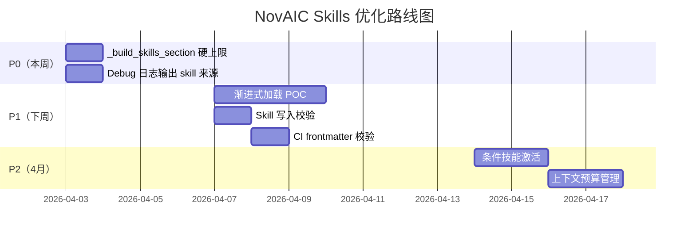

# Claude Code Skills 架构深度分析

> 基于 `thirdparty/claude-code` 泄露源码（v2.1.88）逆向分析
> 对比对象：NovAIC Skills 系统
> 分析日期：2026-04-02

---

## 一、核心设计理念：渐进式披露（Progressive Disclosure）

Claude Code 最关键的设计区别在于 **Skills 内容不在启动时注入 System Prompt**。它采用「三层渐进式披露」架构：

| 层级 | 内容 | 何时加载 | Token 成本 |
|------|------|----------|-----------|
| **Layer 1: 元数据** | name + description + whenToUse | 启动时总是注入 | ~100 tokens/skill |
| **Layer 2: 指令体** | SKILL.md body（步骤/流程/规则） | 用户调用 `/skill-name` 时 | ~500-3000 tokens |
| **Layer 3: 引用文件** | scripts/、docs/、templates/ | Skill body 引用时按需读取 | 按需 |

```
启动加载: [name, description, whenToUse] × N skills ≈ 100×N tokens
调用时: getPromptForCommand() → 加载 SKILL.md body
引用时: Read/Grep tool → 按需读取 scripts/docs
```

### NovAIC 对比

NovAIC 当前是 **全量注入模式**：`_build_skills_section()` 将所有匹配到的 skill 的 `description + prompt + workflow` 一次性拼入 system prompt。

**差距评估**：这是 Claude Code 在 Skills 上最领先的点。当技能数量超过 10 个、或单个技能 prompt 超过 2000 字时，NovAIC 的上下文成本将显著高于 Claude Code。

---

## 二、Skills 发现机制

### 2.1 四层扫描源（Priority 从高到低）

```
源码位置: src/skills/loadSkillsDir.ts → getSkillDirCommands()
```

| 优先级 | 源 | 路径 | 说明 |
|--------|-----|------|------|
| 1 | **Managed** (policySettings) | `${MANAGED_PATH}/.claude/skills/` | 组织策略注入，不可被用户覆盖 |
| 2 | **User** (userSettings) | `~/.claude/skills/` | 用户全局 skills |
| 3 | **Project** (projectSettings) | `.claude/skills/` (从 cwd 向上遍历到 HOME) | 项目级 skills |
| 4 | **Legacy** | `.claude/commands/` | 向后兼容旧格式 |
| 5 | **Bundled** | 编译进二进制 | 内置 skills（/debug, /remember 等） |
| 6 | **MCP** | MCP Server 远程提供 | 远程技能扩展 |
| 7 | **Dynamic** | 运行时文件操作触发发现 | 见 §2.3 |

### 2.2 Skill 目录格式（严格规范）

```
.claude/skills/
├── my-skill/
│   ├── SKILL.md          ← 必须，唯一入口
│   ├── scripts/          ← 可选，引用文件
│   │   └── build.sh
│   └── docs/
│       └── reference.md
```

**关键约束**：
- `/skills/` 目录 **只支持目录格式**（`skill-name/SKILL.md`），不支持单文件 `.md`
- `/commands/` 目录（legacy）同时支持目录和单文件
- SKILL.md 必须有 YAML frontmatter

### 2.3 动态技能发现（Dynamic Discovery）⭐

```
源码位置: src/skills/loadSkillsDir.ts → discoverSkillDirsForPaths()
```

这是 Claude Code 最精妙的机制：

1. **触发时机**：每次 Read/Write/Edit 文件操作时
2. **扫描逻辑**：从文件路径向上遍历到 cwd，查找 `.claude/skills/` 目录
3. **去重**：已扫描过的路径不会重复扫描（`dynamicSkillDirs` Set）
4. **gitignore 尊重**：对 `node_modules/` 等 gitignored 目录自动跳过
5. **优先级**：路径越深的 skill 优先级越高（deepest first）

```typescript
// 伪代码：当用户操作 src/components/Button.tsx 时
discoverSkillDirsForPaths(["src/components/Button.tsx"], cwd)
// 扫描: src/components/.claude/skills/
// 扫描: src/.claude/skills/
// 不扫描 cwd/.claude/skills/（启动时已加载）
```

### 2.4 条件技能激活（Conditional Skills）⭐

```
源码位置: src/skills/loadSkillsDir.ts → activateConditionalSkillsForPaths()
```

Skills 可以在 frontmatter 中声明 `paths` 字段，只有当用户操作匹配的文件时才激活：

```yaml
---
name: react-component
description: React component guidelines
paths:
  - "src/components/**"
  - "*.tsx"
---
```

- **匹配引擎**：使用 `ignore` 库（gitignore 风格 glob）
- **激活是永久的**：一旦激活，整个会话期间都可用
- **启动时分离**：条件 skills 在加载时被分到 `conditionalSkills` Map，不占用初始上下文

---

## 三、SKILL.md Frontmatter 规范

```
源码位置: src/skills/loadSkillsDir.ts → parseSkillFrontmatterFields()
```

| 字段 | 类型 | 用途 |
|------|------|------|
| `name` | string | 显示名（覆盖目录名） |
| `description` | string | Layer 1 元数据，始终在 prompt 中 |
| `when_to_use` | string | 告诉模型何时应该调用此 skill |
| `allowed-tools` | string[] | 此 skill 可使用的工具白名单 |
| `arguments` | string/string[] | 支持 `$1`, `${ARG_NAME}` 参数替换 |
| `argument-hint` | string | 参数提示文本 |
| `model` | string | 指定使用的模型（可覆盖默认） |
| `user-invocable` | boolean | 是否可被用户直接 `/invoke` |
| `disable-model-invocation` | boolean | 禁止模型自动调用 |
| `context` | "fork" | 是否在独立 fork 中执行 |
| `agent` | string | 指定执行的 agent |
| `effort` | string/int | 执行复杂度等级 |
| `paths` | string/string[] | 条件激活路径（gitignore 格式） |
| `hooks` | object | 生命周期钩子 |
| `shell` | string | 指定 shell 执行环境 |
| `version` | string | 版本号 |

### Token 预算仅计算 Layer 1

```typescript
// src/skills/loadSkillsDir.ts L100-104
export function estimateSkillFrontmatterTokens(skill: Command): number {
  const frontmatterText = [skill.name, skill.description, skill.whenToUse]
    .filter(Boolean)
    .join(' ')
  return roughTokenCountEstimation(frontmatterText)
}
```

**关键洞察**：Claude Code 的 token 预算计算只计 `name + description + whenToUse`，不计 body。因为 body 是 **按需加载** 的，只有 `getPromptForCommand()` 被调用时才进入上下文。

---

## 四、上下文压缩管线（Compact Pipeline）

```
源码位置: src/services/compact/
```

### 4.1 五阶段压缩

| 阶段 | 文件 | 触发条件 | 机制 |
|------|------|----------|------|
| **1. Time-based MC** | `microCompact.ts` | 距上次 assistant 消息 > N 分钟 | 清除旧 tool_result 内容 |
| **2. Cached MC** | `cachedMicrocompact.ts` | 可压缩 tool 数量超阈值 | 使用 API 的 cache_edits 删除 |
| **3. Session Memory** | `sessionMemoryCompact.ts` | autocompact 触发前优先 | 压缩 session memory 文件 |
| **4. AutoCompact** | `autoCompact.ts` | token 用量 > context_window - 13k buffer | 对话摘要 + 重建 |
| **5. Reactive Compact** | `compact.ts` | API 返回 prompt_too_long | 紧急压缩 + 重试 |

### 4.2 关键常量

```typescript
// autoCompact.ts
MAX_OUTPUT_TOKENS_FOR_SUMMARY = 20_000          // 压缩摘要最大 token
AUTOCOMPACT_BUFFER_TOKENS = 13_000              // 触发阈值缓冲
WARNING_THRESHOLD_BUFFER_TOKENS = 20_000        // 警告阈值
MAX_CONSECUTIVE_AUTOCOMPACT_FAILURES = 3        // 熔断器

// SessionMemory/prompts.ts
MAX_TOTAL_SESSION_MEMORY_TOKENS = 12_000        // SessionMemory 总上限
```

### 4.3 Circuit Breaker 机制（NovAIC 可借鉴）

```typescript
// 连续 3 次 autocompact 失败后停止重试
if (tracking?.consecutiveFailures >= MAX_CONSECUTIVE_AUTOCOMPACT_FAILURES) {
  return { wasCompacted: false }
}
```

**NovAIC 启发**：当前 NovAIC 无任何上下文压缩机制。首要可借鉴的是 autocompact 的**触发阈值 + 熔断器**模式。

---

## 五、Bundled Skills 机制

```
源码位置: src/skills/bundledSkills.ts + src/skills/bundled/
```

Bundled skills 是编译进二进制的内置技能，通过 `registerBundledSkill()` 注册：

| Skill | 文件 | 用途 |
|-------|------|------|
| `/debug` | debug.ts | 调试辅助 |
| `/remember` | remember.ts | 记忆管理 |
| `/simplify` | simplify.ts | 代码简化 |
| `/skillify` | skillify.ts | 将对话转为 skill |
| `/loop` | loop.ts | 循环执行 |
| `/batch` | batch.ts | 批量操作 |
| `/stuck` | stuck.ts | 卡住时自诊断 |
| `/claude-api` | claudeApi.ts | API 调用 |
| `/schedule` | scheduleRemoteAgents.ts | 远程 agent 调度 |

**引用文件懒加载**：Bundled skills 可声明 `files` 字段，这些文件在 **首次调用时** 才被解压到磁盘（`extractBundledSkillFiles()`），并在 prompt 前插入 `Base directory for this skill: <dir>`。

---

## 六、与 NovAIC 对比及可行动差距

### 6.1 架构差异总览

| 维度 | Claude Code | NovAIC | 差距 |
|------|-------------|--------|------|
| **加载策略** | 渐进式（元数据→body→引用文件） | 全量注入 | 🔴 大 |
| **发现机制** | 4层目录 + 动态发现 + 条件激活 | DB + builtin 目录 | 🟡 中 |
| **Token 预算** | 仅 frontmatter 计入系统预算 | 全部计入 | 🔴 大 |
| **压缩管线** | 5 阶段 pipeline + 熔断器 | 无 | 🔴 大 |
| **多端同步** | 无（纯本地文件） | Entangled 实时同步 | 🟢 NovAIC 领先 |
| **用户管理** | 无 CRUD UI | 完整 CRUD + fork | 🟢 NovAIC 领先 |
| **安全隔离** | 文件系统权限 | user_id + DB 隔离 | 🟢 NovAIC 领先 |

### 6.2 NovAIC 可借鉴的 Top 3

#### 🥇 渐进式加载（优先级最高）

**当前**：`_build_skills_section()` 全量注入所有 skill 的 description + prompt + workflow。

**改造方案**：
```python
# 改为两阶段
# 阶段 1：system prompt 仅注入元数据目录
def _build_skills_directory(skills) -> str:
    """仅注入 name + description，~100 tokens/skill"""
    lines = ["## 可用技能目录"]
    for s in skills:
        lines.append(f"- **{s['name']}**: {s['description'][:100]}")
    return "\n".join(lines)

# 阶段 2：工具调用时加载全文
# 新增一个 tool: load_skill_detail(skill_id) → 返回完整 prompt+workflow
```

**工作量**：~2-3 天（需改 system_prompt.py + 新增工具 + 测试）

#### 🥈 条件技能激活

**方案**：在 `SkillRepository.match_skills_for_task()` 中加入文件路径匹配：
```python
# 当 agent 操作文件时，检查 skill 的 paths 字段
def match_skills_by_file_paths(file_paths: List[str]) -> List[Skill]:
    ...
```

**工作量**：~1 天

#### 🥉 上下文预算 + 熔断器

**方案**：在 `_build_skills_section()` 加入硬上限 + 超限 compact 模式（已在之前的优化计划中详述）。

**工作量**：~30 分钟

---

## 七、不建议照搬的部分

1. **文件系统发现**：NovAIC 是 SaaS 架构，用 DB + Entangled 比扫文件系统更合适
2. **Legacy commands/**：历史包袱，无需引入
3. **MCP Skills**：NovAIC 自身的 MCP 体系更成熟，无需参考
4. **Shell 内嵌执行** (`!` 语法)：安全风险高，NovAIC 已有 tools-server 隔离更安全

---

## 八、推荐执行路线图


