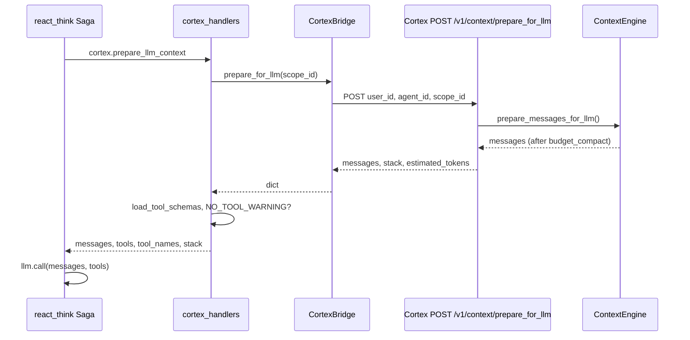

# Agent Runtime → Cortex 调用链（`cortex.prepare_llm_context`）

> 源码：**`novaic-agent-runtime`**：`task_queue/topics.py`、`task_queue/handlers/cortex_handlers.py`、`task_queue/utils/cortex_bridge.py`、`task_queue/sagas/react_think.py`；**Cortex**：`novaic_cortex/api.py` **`context_prepare_for_llm`**、`context_stack/engine.py`。

跨服务约定名：**topic `cortex.prepare_llm_context`**（`TaskTopics.CORTEX_PREPARE_LLM_CONTEXT`）。Cortex 仓库内 **没有** 同名 Python 函数；HTTP 实现为 **`POST /v1/context/prepare_for_llm`**。

---

## 1. 从 Saga 到 Handler

**ReactThink**（`task_queue/sagas/react_think.py`）第一步：

| 字段 | 值 |
|------|-----|
| step name | **`prepare_context`** |
| topic | **`TaskTopics.CORTEX_PREPARE_LLM_CONTEXT`**（字符串 **`cortex.prepare_llm_context`**） |
| payload | **`scope_id`、`agent_id`、`user_id`**（`_build_prepare_context_payload`） |

下一步 **`call_llm`** 使用上一步返回的 **`messages` / `tools`**（见 §3）。

---

## 2. `CortexBridge.prepare_for_llm`

**`cortex_bridge.py`**：

- 若 bridge **未启用**：返回 **`{"messages": [], "stack": []}`**。  
- 否则 **`POST`** 到 Cortex：**`/v1/context/prepare_for_llm`**，JSON body：**`user_id`、`agent_id`、`scope_id`**（与 internal API 约定一致，**无** Bearer）。

---

## 3. Cortex HTTP：`context_prepare_for_llm`

**`api.py`**：

1. **`ws = _get_workspace(user_id, agent_id)`**  
2. **`scope_path = /ro/active/{scope_id}`**（根 scope 前缀常量 **`ROOT_SCOPE_PREFIX`**）  
3. **`load_engine_config(ws)`** → **`engine_config_to_compact_config(...)`** → **`ContextEngine(..., config=compact_cfg)`** → **`await engine.prepare_messages_for_llm()`**（内部 **`budget_compact`** 使用与 **`/ro/config/engine.json`** 对齐的 **`CompactConfig`**，见 [budget-compact-algorithm.md](budget-compact-algorithm.md) §8.1）  
4. **`engine.status(messages)`** → 返回 **`estimated_tokens`、`usage_ratio`** 等  
5. 响应 JSON：**`messages`、`stack`（当前 `status` 里 frames 多为占位）、`estimated_tokens`**

---

## 4. Handler：拼 tools + 可选 `NO_TOOL_WARNING`

**`handle_cortex_prepare_llm_context`**（`cortex_handlers.py`）：

1. **`prepare_result = bridge.prepare_for_llm(scope_id)`**  
2. **`_load_tool_schemas(bridge)`**：**`bridge.load_tool_schemas()`** → 转成 OpenAI **`tools[]`**（`type: function`），并收集 **`tool_names`**。  
3. 若最后一条是 **`assistant`** 且 **无 `tool_calls`**：追加一条 **system** **`NO_TOOL_WARNING`**（瞬态提示，见 `system_prompt` 模块）。  
4. 返回 **`success`、`messages`、`tools`、`tool_names`、`stack`**。

随后 Saga 的 **`call_llm`** 用 **`_build_llm_call_payload`**：把 **`prepare_context`** 步骤结果里的 **`messages`、`tools`** 传入 **`llm.call`**（**`llm_handlers.handle_llm_call`**）。**LLM handler 不负责决定工具列表**——注释写明由 Cortex 侧 schema 决定。

---

## 5. 其它 Cortex topic（同桥）

同一 **`CortexBridge`** 上还有（与「拼上下文」并列的技能与时间线操作）：

| 方法 | HTTP |
|------|------|
| **`context_skill_begin`** | `POST /v1/context/skill_begin` |
| **`context_skill_end`** | `POST /v1/context/skill_end` |
| **`context_status`** | `POST /v1/context/status` |

对应 handler：**`handle_cortex_skill_begin` / `handle_cortex_skill_end`**（`cortex_handlers.py`）。

---

## 6. 一览图（Mermaid）

---

## 相关

- [http-api.md](http-api.md) — 完整路由表  
- [budget-compact-algorithm.md](budget-compact-algorithm.md) — Phase B 细节  
- [context-timeline-and-dfs.md](context-timeline-and-dfs.md) — Phase A 时间线  
