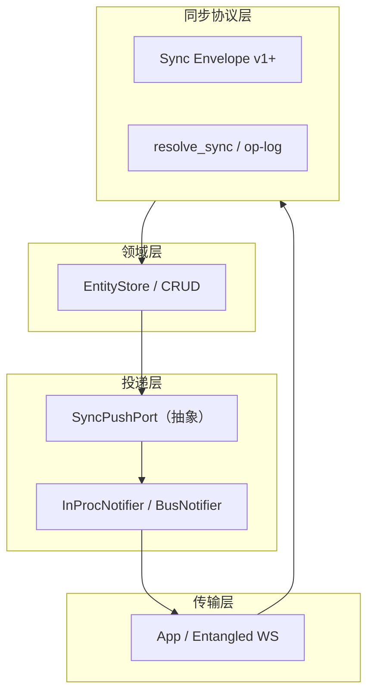

# Entangled / NovAIC 同步栈 — 完备架构升级设计方案

> **定位**：在 [entangled-architecture-upgrade-plan.md](./entangled-architecture-upgrade-plan.md)（执行清单与里程碑）之上，给出**目标架构、边界、关键决策与分期路线**，并**采纳**近期架构评审中**可行**的建议（推送策略、双路径 reconcile、线程模型、多 worker、安全上限、模块化等）。  
> **不推翻** [HANDOVER.md](../HANDOVER.md) Path C：Rust 管订阅生命周期、React 失效驱动读、写经 `dispatch`/Rust optimistic。

---

## 一、设计目标与非目标

### 1.1 目标（12–24 个月可演进）

| 维度 | 目标状态 |
|------|-----------|
| **契约** | 订阅身份 `(entity, params)`、主键 `idField`、sync mode 语义在**协议 + CI 测试**中单一真源；跨语言无「静默分区错误」。 |
| **正确性** | op-log 缺口、重连 delta、prepend 与 head 重置（语义 B）**文档化 + 可观测**；客户端不因丢帧而长期错状态。 |
| **运行时** | Gateway asyncio **不被 SQLite/CPU 长尾阻塞**；桌面端 sync **有界内存 + 可解释背压**；线程池有**上限与指标**。 |
| **安全** | WS 上身份、授权、帧大小/速率、cascade 广度、每连接并发任务**可配置、可审计**。 |
| **演进** | Notifier/推送与 Store **可替换实现**（in-proc → 总线）；多 worker **有明确拓扑**（粘性或广播）。 |
| **工程** | `defs` → codegen（TS/Rust）减少手工抄表；宿主（Tauri/OTA）边界清晰。 |

### 1.2 非目标（本方案不承诺）

- 一次性重写为 CRDT/离线优先协作引擎。
- 在未立项前强制上 Redis/NATS（阶段 4 仍为**可选容量项**）。
- 改变「服务端为真源、客户端为物化缓存」的基本模型。

---

## 二、现状与目标形态（逻辑架构）

### 2.1 当前主要张力（摘要）

- **双速路径**：Python subscribe 在 `to_thread` 后于事件循环上 reconcile delta；偶发主线程二次 `resolve_sync`。
- **推送策略不对等**：服务端 push 队列可**丢最老**；桌面 sync 队列**背压不丢**（行为需统一语义或分级）。
- **全局耦合**：`notifier` 模块单例 + 业务广泛 `notify_entity_change`；多 worker 无共享注册表。
- **三处阻塞资源**：Python 默认线程池、Tokio blocking 池、SQLite 单写者 — 排障需**关联指标**。
- **Rust**：每帧 `spawn_blocking` 简洁但有调度税；可演进为**单写者**线程。

### 2.2 目标：有界上下文（Bounded Contexts）

**规则**：

- **Store** 不直接 import 全局 `notify_entity_change`；通过 **PushPort**（构造注入或应用上下文）发「实体已变」事件。
- **WS 层**只校验帧、路由到 handler；**鉴权/配额**在进 Store 或进线程池之前完成。
- **客户端 Rust `Cache`** 保持物化视图 + pending；**不负责**跨用户授权。

### 2.3 数据面与控制面

| 平面 | 内容 |
|------|------|
| **控制面** | 订阅/取消订阅、schema、ping、错误码、`clientCapabilities`（未来）。 |
| **数据面** | `sync` 帧、`request`/`response`、`load_more`；体积与频率受配额约束。 |

---

## 三、关键架构决策（已接受的可行建议 → 设计定稿）

### ADR-1：订阅身份与参数规范

- **决策**：以 **canonical JSON params**（键排序、标量字符串化约定）为权威；Python `_state_key` 与 Rust `hash_params` **不要求数值相等**，但**同一逻辑订阅**在双方必须映射到**同一分区**（见 [entangled-params-canonical.md](./entangled-params-canonical.md)）。
- **落地**：CI 双端向量测试 + 可选 codegen 生成「订阅键」常量（与阶段 3 合并）。

### ADR-2：Stream op-log 缺口（语义 B）

- **决策**：v1 **语义 B** — `apply_snapshot` / `head_n` 替换 head 分区，不保留本地 prepend 页（与协议 §9 一致）。
- **演进**：若未来需要语义 A，需**显式协议字段**（如 `mergeStrategy`）与 Rust `apply_snapshot` 分支，禁止静默改语义。

### ADR-3：Gateway 线程卸载

- **决策**：**允许** `asyncio.to_thread` 承载阻塞式 Store/DB；**前提**是宿主 DB **线程本地连接**或等价安全模型（NovAIC `Database` 已满足）。
- **约束**：**授权、参数规范化、cascade 深度上限、帧大小**在进线程前完成。
- **改进**：subscribe **delta reconcile** 若触发主线程二次 `resolve_sync`，应 **(a)** `to_thread` 包裹该回退，或 **(b)** 限制其 CPU/SQL 并在指标中计数 — 消除「双速路径」中的 loop 阻塞。

### ADR-4：服务端出站推送队列

- **决策**：**禁止在无策略下丢弃 `type: sync`**。在实现上分档：
  - **P0**：队列满时 **丢弃非 sync**（如可再生的 push）或 **合并**同 `(entity,params)` 的最新 sync（coalesce）。
  - **P1**：客户端 **流控**（ack / credit）或按连接限速。
- **落地**：替换当前「一律丢最老」为 **分级策略 + 指标**（`dropped_sync`、`coalesced_sync`）。

### ADR-5：桌面端 sync 管道

- **决策**：保持 **有界队列 + 顺序应用**；演进选项：
  - **短期**：维持 `spawn_blocking` + 指标。
  - **中期**：**单 dedicated blocking 任务**持有 `Cache`，串行 `process_sync`，去掉每帧线程池调度税。
- **决策**：背压时 **heartbeat 可交错** 已采纳；文档化 SLA 为**观测项**而非合同数值（除非产品明确）。

### ADR-6：Notifier 与多 worker

- **决策**：**单进程**维持 InProcNotifier；**多 worker** 必须二选一（写进 Runbook）：
  - **粘性会话** + 变更与 WS 同 worker；或
  - **共享总线**（Redis/NATS）+ 连接注册表，worker 只推本机 FD。
- **决策**：将 notifier **接口化**（`SyncPushPort`），全局单例变为**应用生命周期对象**，便于测试与替换实现。

### ADR-7：安全与滥用面

- **决策**：**JWT/握手为唯一用户身份**；header 伪造与 `push_to_all` 内容需审计清单。
- **决策**：每 App WS 连接：**最大并发 `create_task`、单帧大小、cascade 目标数、subscribe 频率** — 配置化 + 超限可断开或降级。

---

## 四、分阶段完备路线图（与现有阶段对齐并扩展）

与 [entangled-architecture-upgrade-plan.md](./entangled-architecture-upgrade-plan.md) **共用里程碑编号**；本节补充 **2.x 后续、6.x 新增**。

### 阶段 A — 契约与协议（≈ 原 0–1 + 补强）

| ID | 内容 | 验收 |
|----|------|------|
| A.1 | 协议文档版本号与 `resyncReason`（可选）占位 | 评审签字 |
| A.2 | Params / idField CI 向量与 codegen 准备（衔接原 3.2） | `pytest` + `cargo test` |
| A.3 | 老客户端 × 新网关冒烟矩阵 | 表格勾选 |

### 阶段 B — 运行时硬化（≈ 原 2 + 扩展）

| ID | 内容 | 验收 |
|----|------|------|
| B.1 | **推送队列分级**：不丢 sync（合并或降级非关键 push） | 压测 + 单测模拟满队列 |
| B.2 | subscribe **reconcile 回退**不再阻塞 loop（`to_thread` 或限流） | `asyncio` 延迟指标 |
| B.3 | **线程池可观测**：Python `to_thread` 队列深度（若可）、Rust blocking 任务耗时 P99 | Grafana/日志字段 |
| B.4 | **Rust 单写者 cache worker**（可选里程碑） | 同负载下 P95 对比 [entangled-load-test.md](./entangled-load-test.md) |
| B.5 | per-WS **任务/semaphore** 限制 | fuzz 单连接狂发 request |

### 阶段 C — 模块化（≈ 原 3 + notifier 解耦）

| ID | 内容 | 验收 |
|----|------|------|
| C.1 | 引入 **SyncPushPort**；Store/Repository 经端口发事件 | 单测 mock 推送 |
| C.2 | 逐步迁移 `notify_entity_change` 调用点至端口（分 PR） | grep 计数下降 |
| C.3 | defs 拆分 + **idField/keyParams codegen** | CI `--check` |
| C.4 | TS `stableParams` / queryKey 与 canonical 对齐 | 前端单测或契约测试 |

### 阶段 D — 横向扩展（原 4，条件触发）

| ID | 内容 | 验收 |
|----|------|------|
| D.1 | Threat model：多租户误推、粘性错误 | 文档 |
| D.2 | 总线原型 + 双 worker 冒烟 | Runbook |
| D.3 | Subscribe **批量读库** / 帧合并（可选） | P99 对比 |

### 阶段 E — 宿主与安全（原 5，强化）

| ID | 内容 | 验收 |
|----|------|------|
| E.1 | EntangledHost Context（可测、可 mock） | Storybook/单测不启 Tauri |
| E.2 | **capabilities** 与 OTA WebView 敏感 command 对照表 | 安全评审勾选 |
| E.3 | `push_to_all` 调用点审计与分类 | 清单 |

---

## 五、观测与 SLO（建议字段）

| 组件 | 指标 / 日志字段 |
|------|-----------------|
| Gateway WS | 每连接 `outbound_queue_depth`、`sync_dropped`、`sync_coalesced`、`task_inflight` |
| subscribe | `resolve_thread_ms`、`reconcile_fallback_count`、`cascade_targets` |
| app_bridge | 已有 `conn_seq`、`process_ms`、队列饱和；补充 **applied_frame_lag**（可选） |
| entangled_cache | `pool_checkout_fail`（已有 op 字段） |

**SLO 建议**：以「**无 undropped sync**」「**P99 subscribe < X ms**（内网基线）」为产品化前先**采集**再定标。

---

## 六、风险与回滚

| 风险 | 缓解 | 回滚 |
|------|------|------|
| 推送策略改动导致内存涨 | 合并窗口 + 上限 + 监控 | 特性开关回退丢包策略 |
| PushPort 迁移漏通知 | 双写短期、对比测试 | 恢复直调 notifier |
| 单写者 Rust 死锁 | 严格单线程写 cache、超时日志 | 回退 `spawn_blocking` |
| 多 worker 粘性错配 | 灰度、强制单 worker 开关 | 运维切回单实例 |

---

## 七、文档与代码映射（实施索引）

| 主题 | 已有文档 / 代码 |
|------|-----------------|
| 协议 v1 | [entangled-sync-protocol-v1.md](./entangled-sync-protocol-v1.md) |
| 主键 | [entangled-pk-conventions.md](./entangled-pk-conventions.md) |
| Params | [entangled-params-canonical.md](./entangled-params-canonical.md) |
| 压测 | [entangled-load-test.md](./entangled-load-test.md) |
| 执行勾选 | [entangled-architecture-upgrade-plan.md](./entangled-architecture-upgrade-plan.md) |
| Python subscribe/thread | `entangled/server/ws_handler.py`, `sync.py` |
| Notifier | `entangled/server/notifier.py` |
| 桌面 | `novaic-app/src-tauri/src/core/app_bridge.rs` |
| 本地引擎 | `Entangled/packages/client-rust/` |
| PushPort（C.1） | `entangled/server/push_port.py`、`InProcSyncPushPort` |
| `push_to_all` 审计（E.3） | [entangled-push-to-all-audit.md](./entangled-push-to-all-audit.md) |
| 多 worker 威胁摘要（D.1） | [entangled-multi-worker-threat-model.md](./entangled-multi-worker-threat-model.md) |
| Tauri 能力审计（E.2） | [entangled-tauri-capabilities-audit.md](./entangled-tauri-capabilities-audit.md) |
| Rust 单写者笔记（B.4） | [entangled-rust-single-writer-notes.md](./entangled-rust-single-writer-notes.md) |
| idField 生成物 | `generated_entity_id_fields.json` + `export_entity_id_fields.py`；Rust `build.rs`；App `generated_entity_id_fields.json`；`scripts/sync_entity_id_fields.sh` |

---

## 八、修订历史

| 日期 | 说明 |
|------|------|
| 2026-04-01 | 初版：汇总可行评审建议 + 目标边界 + ADR + 分期 B/C/E 扩展项 |

---

**下一步建议（产品/工程共同拍板）**：(1) **ADR-4** 推送分级的产品优先级；(2) **B.2** 与 **B.1** 是否同一发布火车；(3) **C.1** 是否单独立专项（影响面大但长期收益最高）。
