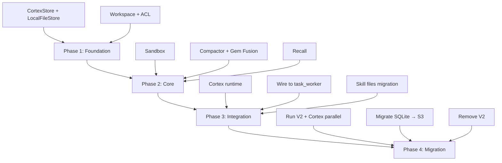

# NovAIC Cortex — Complete Design Document

> **The cognitive infrastructure for AI agents.**
> Memory, skills, workspace, shell — unified as files.

---

## 1. Design Philosophy

```
Everything is a file.  State is the filesystem.  The engine is a file operator.
```

**Three axioms:**
1. **File-native** — All state (scopes, skills, config, knowledge) is stored as files in S3
2. **Stateless execution** — Each shell command runs in an ephemeral sandbox; no process state survives
3. **Agent autonomy** — The engine provides tools (`read`, `write`, `shell`), the agent decides what to do

**Neuroscience mapping:**

| Brain Region | Cortex Component | Function |
|---|---|---|
| Prefrontal Cortex | Workspace `/rw` | Working memory, active tasks |
| Hippocampus | Memory `/ro/scopes/` | Long-term memory formation & retrieval |
| Cerebellum | Skills `/ro/skills/` | Procedural memory, learned skills |
| Motor Cortex | Sandbox `shell()` | Action execution |
| Sensory Cortex | FuzzyMemory | Environmental awareness, auto-injection |
| Basal Ganglia | Compaction Pipeline | Habit formation, information compression |

---

## 2. Architecture Overview

```
┌──────────────────────────────────────────────────────────────────────────────┐
│                          LLM (Claude / Gemini / GPT)                        │
│                                                                              │
│  System Prompt (auto-injected by Cortex):                                    │
│    - Fuzzy Memory    ← /ro/scopes/*/summary.md   → "你之前做过..."           │
│    - Skill Directory ← /ro/skills/_index.md       → "你有这些技能..."        │
│    - Config          ← /ro/config/*               → "你的偏好是..."          │
│                                                                              │
│  Tools (4 primitives):                                                       │
│    read(path)        → Workspace.read()       读任意路径                     │
│    write(path, data) → Workspace.write()      只写 /rw                      │
│    shell(cmd)        → Sandbox.exec()         沙箱执行                      │
│    scope_end(id)     → Compactor.compact()    触发归档                      │
│                                                                              │
└──────────┬──────────────┬──────────────┬──────────────┬───────────────────────┘
           │              │              │              │
           ▼              ▼              ▼              ▼
┌──────────────────────────────────────────────────────────────────────────────┐
│                            Cortex Runtime                                    │
│                                                                              │
│  ┌────────────────────────────────────────────────────────────────────────┐  │
│  │                    Layer 1: Infrastructure                             │  │
│  │                                                                        │  │
│  │  ┌─────────────┐  ┌──────────────────┐  ┌───────────────────────┐     │  │
│  │  │  CortexStore │  │  Workspace       │  │  Sandbox              │     │  │
│  │  │  (S3 KV)     │  │  (/ro + /rw ACL) │  │  (stateless shell)    │     │  │
│  │  │  put/get/    │  │  read/write/     │  │  exec(cmd)            │     │  │
│  │  │  list/move   │  │  archive_scope() │  │  mounts /ro + /rw     │     │  │
│  │  └──────┬───────┘  └───────┬──────────┘  └──────────┬────────────┘     │  │
│  │         └──────────────────┴─────────────────────────┘                  │  │
│  │                            │                                            │  │
│  │                      S3 Bucket / LocalFS                                │  │
│  └────────────────────────────────────────────────────────────────────────┘  │
│                                                                              │
│  ┌────────────────────────────────────────────────────────────────────────┐  │
│  │                    Layer 2: Pipelines                                  │  │
│  │                                                                        │  │
│  │  ┌──────────────────────┐   ┌────────────────────────────────────┐    │  │
│  │  │  Compactor           │   │  Recall                            │    │  │
│  │  │                      │   │                                    │    │  │
│  │  │  messages.jsonl →    │   │  /ro/scopes/*/summary.md →        │    │  │
│  │  │    summary.md        │   │    system prompt injection         │    │  │
│  │  │  mv /rw → /ro        │   │  + /ro/skills/* directory          │    │  │
│  │  │  gem fusion          │   │  + /ro/config/* preferences        │    │  │
│  │  └──────────────────────┘   └────────────────────────────────────┘    │  │
│  └────────────────────────────────────────────────────────────────────────┘  │
└──────────────────────────────────────────────────────────────────────────────┘
```

---

## 3. S3 Bucket Layout

```
s3://novaic-cortex/
└── agents/
    └── {agent_id}/
        │
        ├── ro/                              ══ Read-Only Zone ══
        │   │
        │   ├── config/                      # Engine + Agent configuration
        │   │   ├── engine.json              # compaction params, model prefs
        │   │   ├── personality.md           # agent persona description
        │   │   └── constraints.md           # behavioral constraints
        │   │
        │   ├── skills/                      # Skill library
        │   │   ├── _index.md                # Auto-generated skill directory (L1)
        │   │   ├── web-dev/
        │   │   │   ├── SKILL.md             # Skill instructions (L2)
        │   │   │   ├── meta.json            # {name, desc, when_to_use, keywords, priority}
        │   │   │   ├── examples/            # Reference files (L3)
        │   │   │   └── templates/
        │   │   ├── code-review/
        │   │   │   ├── SKILL.md
        │   │   │   ├── meta.json
        │   │   │   └── checklist.md
        │   │   └── debugging/
        │   │       ├── SKILL.md
        │   │       └── meta.json
        │   │
        │   ├── scopes/                      # Archived memory (replaces SQLiteStore)
        │   │   ├── _index.md                # Scope directory (auto-generated)
        │   │   ├── abc123/                  # Single archived scope
        │   │   │   ├── meta.json            # {name, skill, time, files, tools, level, parent_id}
        │   │   │   ├── summary.md           # Compacted summary (fuzzy memory source)
        │   │   │   └── messages.jsonl       # Raw conversation (precise recall, grep)
        │   │   ├── def456/
        │   │   │   └── ...
        │   │   └── __fused__/               # Gem Fusion products
        │   │       ├── fuse_L1_001/
        │   │       │   ├── meta.json        # {level: 1, children_ids: [...]}
        │   │       │   └── summary.md
        │   │       └── fuse_L2_001/
        │   │           ├── meta.json
        │   │           └── summary.md
        │   │
        │   └── knowledge/                   # Long-term learned knowledge
        │       ├── preferences.md           # "User prefers dark mode"
        │       ├── codebase_map.md          # "Project structure and conventions"
        │       └── learned_patterns.md      # "Discovered patterns"
        │
        └── rw/                              ══ Read-Write Zone ══
            │
            ├── active/                      # Currently executing scopes
            │   └── scope-789/
            │       ├── meta.json            # {name, skill, start_time, phase: "executing"}
            │       ├── messages.jsonl        # Appended conversation
            │       └── scratch/             # Agent's scratchpad
            │           ├── analysis.md
            │           └── todo.md
            │
            └── scratch/                     # Global scratch (no scope)
                └── notes.md
```

---

## 4. Component Specifications

### 4.1 CortexStore (S3 Abstraction)

> Pure KV object storage. Knows nothing about workspaces or scopes.

```python
class CortexStore(ABC):
    """Backend-agnostic object storage interface."""

    # Core CRUD
    async def put(self, key: str, data: bytes, content_type: str = "") -> None: ...
    async def get(self, key: str) -> bytes: ...
    async def get_text(self, key: str, encoding: str = "utf-8") -> str: ...
    async def exists(self, key: str) -> bool: ...
    async def delete(self, key: str) -> None: ...

    # Listing
    async def list_objects(self, prefix: str, delimiter: str = "/") -> List[ObjectInfo]: ...
    async def list_recursive(self, prefix: str) -> List[str]: ...

    # Convenience
    async def put_json(self, key: str, obj: dict) -> None: ...
    async def get_json(self, key: str) -> dict: ...
    async def copy(self, src: str, dst: str) -> None: ...
    async def move(self, src: str, dst: str) -> None: ...
    async def move_prefix(self, src_prefix: str, dst_prefix: str) -> int: ...
```

**Backends:**

| Backend | Use Case | Implementation |
|---|---|---|
| `LocalFileStore` | Dev / testing | Local filesystem simulates S3 |
| `S3Store` | Production | AWS S3 / MinIO |
| `MemoryStore` | Unit tests | In-memory dict |

### 4.2 Workspace

> Dual-zone file manager with ACL enforcement.

```python
class Workspace:
    def __init__(self, store: CortexStore, agent_id: str): ...

    # Read (both /ro and /rw)
    async def read(self, path: str) -> str: ...
    async def read_bytes(self, path: str) -> bytes: ...
    async def list_dir(self, path: str) -> List[FileEntry]: ...
    async def exists(self, path: str) -> bool: ...

    # Write (only /rw — raises PermissionError for /ro)
    async def write(self, path: str, content: str) -> None: ...
    async def write_bytes(self, path: str, data: bytes) -> None: ...
    async def write_json(self, path: str, obj: dict) -> None: ...
    async def append_line(self, path: str, line: str) -> None: ...  # for JSONL
    async def delete(self, path: str) -> None: ...

    # Scope lifecycle (system-level, bypasses /ro restriction)
    async def create_scope(self, scope_id: str, name: str, skill: str = "") -> str: ...
    async def archive_scope(self, scope_id: str, summary: str) -> str: ...
    async def list_active_scopes(self) -> List[str]: ...
    async def get_scope_depth(self) -> int: ...

    # Initialization
    async def initialize(self) -> None: ...
```

**ACL Rules:**

| Path Pattern | Agent Read | Agent Write | System Write |
|---|---|---|---|
| `/ro/**` | ✅ | ❌ | ✅ (archive, skill install) |
| `/rw/**` | ✅ | ✅ | ✅ |

**`archive_scope()` flow:**

```
/rw/active/{id}/          →  /ro/scopes/{id}/
  1. Write summary.md to /rw/active/{id}/
  2. Update meta.json (phase → "archived", ended_at)
  3. move_prefix /rw/active/{id}/ → /ro/scopes/{id}/
  4. Append entry to /ro/scopes/_index.md
```

### 4.3 Sandbox

> Stateless, ephemeral command execution environment.

```python
@dataclass
class ShellResult:
    stdout: str
    stderr: str
    exit_code: int
    files_changed: list[str]   # /rw changes list

class Sandbox:
    def __init__(self, workspace: Workspace): ...

    async def exec(
        self,
        command: str,
        timeout: int = 30,
        cwd: str | None = None,  # relative to /rw
    ) -> ShellResult: ...
```

**Execution cycle (per command):**

```
1. Create temp directory
2. Sync /ro + /rw from S3 → local
3. Snapshot /rw (file mtimes)
4. Execute command with $RO, $RW env vars
5. Diff /rw snapshot → detect changes
6. Sync changed files back to S3
7. Destroy temp directory
```

**Environment variables injected:**

| Variable | Value | Purpose |
|---|---|---|
| `$RO` | `/tmp/novaic-xxx/ro` | Read-only mount point |
| `$RW` | `/tmp/novaic-xxx/rw` | Read-write mount point |
| `$HOME` | `$RW` | Agent working directory |

**Example agent usage:**

```bash
# Search all archived scope summaries
shell("grep -ril 'JWT' $RO/scopes/")

# Find scopes mentioning auth bugs
shell("grep -l 'auth bug' $RO/scopes/*/summary.md")

# Run a Python analysis script agent wrote earlier
shell("python3 $RW/active/scope-789/scratch/analyze.py")
```

### 4.4 Compactor (CompactionPipeline)

> Scope archival pipeline. Replaces V2's ScopeSession.finalize() + ScopeFuser.

```python
@dataclass
class CompactResult:
    scope_id: str
    summary: str
    archive_path: str

class Compactor:
    def __init__(
        self,
        workspace: Workspace,
        summarizer: Summarizer | None = None,
        fusion_factor: int = 5,
    ): ...

    async def compact(self, scope_id: str, report: str | None = None) -> CompactResult: ...
```

**Pipeline steps:**

```
scope_end(id, report)
  │
  ├─ 1. Read /rw/active/{id}/messages.jsonl
  ├─ 2. Generate summary:
  │      ├─ report provided → use as-is (cheapest)
  │      ├─ summarizer available → LLM call
  │      └─ neither → fallback template
  ├─ 3. Extract metadata (files_changed, tools_used) from messages
  ├─ 4. workspace.archive_scope(id, summary) → mv /rw → /ro
  ├─ 5. Check gem fusion threshold
  └─ 6. Update Recall (fuzzy memory)
```

### 4.5 Gem Fusion (N-ary Carry)

> Progressive scope summarization. Every N scopes at level L → 1 scope at level L+1.

```
L0: [scope-0] [scope-1] [scope-2] [scope-3] [scope-4]  ← 5 raw scopes
         ↓         ↓         ↓         ↓         ↓
L1:              [★ fused-0]                              ← 1 meta-summary

...after 25 scopes total:
L1: [★ f-0] [★ f-1] [★ f-2] [★ f-3] [★ f-4]           ← 5 L1 scopes!
         ↓         ↓         ↓         ↓         ↓
L2:              [★★ mega-0]                              ← CASCADE!
```

| Approach | Active summaries after 100 scopes | Depth |
|---|---|---|
| No fusion | 100 (linear) | 0 |
| Fixed-window | ~20 (rolling) | 0 |
| **5-ary carry** | **~8** (log₅ progression) | 2-3 |

**Storage:** Fused scopes live in `/ro/scopes/__fused__/fuse_L{level}_{seq}/`.

### 4.6 Recall (FuzzyMemoryGenerator)

> Pre-LLM system prompt injection. Replaces V2's prepare_messages + RecallSkill + SkillPromptBuilder.

```python
class Recall:
    def __init__(self, workspace: Workspace, token_budget: int = 4000): ...

    async def generate(self) -> str:
        """Generate system prompt injection content."""
        sections = []
        sections.append(await self._build_memory_section())     # /ro/scopes/
        sections.append(await self._build_skill_directory())    # /ro/skills/
        sections.append(await self._build_config_section())     # /ro/config/
        return "\n\n---\n\n".join(filter(None, sections))
```

**Three injection sources:**

| Source | Content | Agent Action to Drill Deeper |
|---|---|---|
| `/ro/scopes/_index.md` | "你之前做过 X, Y, Z..." | `read("/ro/scopes/{id}/summary.md")` |
| `/ro/skills/_index.md` | "你有 web-dev, debugging 技能..." | `read("/ro/skills/{name}/SKILL.md")` |
| `/ro/config/*` | "用户偏好 dark mode..." | `read("/ro/config/personality.md")` |

**Progressive recall (agent-driven, replaces RecallSkill 511 LOC):**

```python
# Agent navigates memory using standard read + shell tools:

# Level 0: Browse index
read("/ro/scopes/_index.md")

# Level 1: Read specific summary
read("/ro/scopes/abc123/summary.md")

# Level 2: Read raw messages
read("/ro/scopes/abc123/messages.jsonl")

# Cross-scope search
shell("grep -ril 'JWT' $RO/scopes/")
shell("grep -l 'auth bug' $RO/scopes/*/summary.md")
```

---

## 5. Cortex Runtime (Façade)

> The thin shell that assembles everything. Replaces V2's 542-line ContextEngine.

```python
class Cortex:
    """NovAIC Cortex — Cognitive infrastructure for AI agents."""

    def __init__(
        self,
        store: CortexStore,
        agent_id: str,
        summarizer: Summarizer | None = None,
    ):
        # Layer 1: Infrastructure
        self.store = store
        self.workspace = Workspace(store, agent_id)
        self.sandbox = Sandbox(self.workspace)

        # Layer 2: Pipelines
        self.compactor = Compactor(self.workspace, summarizer)
        self.recall = Recall(self.workspace)

    async def initialize(self) -> None:
        """First-time workspace setup."""
        await self.workspace.initialize()

    # ── Agent Tools (exposed to LLM) ──

    async def tool_read(self, path: str) -> str:
        return await self.workspace.read(path)

    async def tool_write(self, path: str, content: str) -> str:
        await self.workspace.write(path, content)
        return f"Written to {path}"

    async def tool_shell(self, command: str, timeout: int = 30) -> ShellResult:
        return await self.sandbox.exec(command, timeout)

    async def tool_scope_end(self, scope_id: str, report: str = "") -> dict:
        result = await self.compactor.compact(scope_id, report)
        return {"ok": True, "scope_id": scope_id, "archive_path": result.archive_path}

    # ── Pre-LLM Hook ──

    async def prepare_system_prompt(self) -> str:
        return await self.recall.generate()

    # ── Skill Management (system-level, writes to /ro) ──

    async def install_skill(self, name: str, skill_md: str, meta: dict) -> str:
        base = f"agents/{self.workspace._agent_id}/ro/skills/{name}/"
        await self.store.put(base + "SKILL.md", skill_md.encode())
        await self.store.put_json(base + "meta.json", meta)
        await self._rebuild_skill_index()
        return f"/ro/skills/{name}/"

    async def _rebuild_skill_index(self) -> None:
        """Regenerate /ro/skills/_index.md from directory listing."""
        prefix = f"agents/{self.workspace._agent_id}/ro/skills/"
        objects = await self.store.list_objects(prefix)
        lines = ["# Available Skills\n"]
        for obj in objects:
            if obj.key.endswith("/") and not obj.key.endswith("skills/"):
                name = obj.key.rstrip("/").split("/")[-1]
                if name.startswith("_"):
                    continue
                try:
                    meta = await self.store.get_json(obj.key + "meta.json")
                    desc = meta.get("description", "")
                    lines.append(f"- **{name}**: {desc}")
                except Exception:
                    lines.append(f"- **{name}**")
        await self.store.put(prefix + "_index.md", "\n".join(lines).encode())
```

---

## 6. Tool Definitions (LLM-facing)

These are the JSON schemas exposed to the LLM as callable tools:

```json
[
  {
    "name": "read",
    "description": "Read a file from your workspace. Use /ro/ for archived data and /rw/ for current work.",
    "parameters": {
      "type": "object",
      "properties": {
        "path": {
          "type": "string",
          "description": "Absolute path starting with /ro/ or /rw/"
        }
      },
      "required": ["path"]
    }
  },
  {
    "name": "write",
    "description": "Write content to a file. Only /rw/ paths are writable.",
    "parameters": {
      "type": "object",
      "properties": {
        "path": {
          "type": "string",
          "description": "Absolute path starting with /rw/"
        },
        "content": {
          "type": "string",
          "description": "File content to write"
        }
      },
      "required": ["path", "content"]
    }
  },
  {
    "name": "shell",
    "description": "Execute a command in a sandboxed shell. $RO and $RW point to workspace mounts.",
    "parameters": {
      "type": "object",
      "properties": {
        "command": {
          "type": "string",
          "description": "Shell command to execute"
        },
        "timeout": {
          "type": "integer",
          "description": "Max seconds (default: 30)",
          "default": 30
        }
      },
      "required": ["command"]
    }
  },
  {
    "name": "scope_end",
    "description": "End the current task scope. Triggers archival and memory compression.",
    "parameters": {
      "type": "object",
      "properties": {
        "scope_id": {
          "type": "string",
          "description": "ID of the scope to close"
        },
        "report": {
          "type": "string",
          "description": "Summary of what was accomplished"
        }
      },
      "required": ["scope_id", "report"]
    }
  }
]
```

---

## 7. Skill System

### V2 (4 components, ~850 LOC)

```
SkillMetadata → SkillBody → SkillReference  (3 dataclasses)
FileSystemSkillStore → SkillRegistry → SkillPromptBuilder  (3 classes)
```

### Cortex (0 dedicated classes, ~30 LOC)

```
/ro/skills/
├── _index.md      ← replaces SkillRegistry + SkillPromptBuilder.build_directory()
├── web-dev/       ← replaces SkillMetadata + SkillBody + SkillReference
│   ├── meta.json  ← Layer 1 (name, desc, when_to_use, keywords)
│   ├── SKILL.md   ← Layer 2 (prompt + workflow)
│   └── examples/  ← Layer 3 (reference files)
└── code-review/
    ├── meta.json
    └── SKILL.md
```

**Progressive loading:**

```
1. System prompt: auto-includes _index.md → "你有 web-dev, code-review 技能"
2. Agent needs skill: read("/ro/skills/web-dev/SKILL.md") → loads full instructions
3. Agent needs reference: read("/ro/skills/web-dev/examples/react-component.tsx")
```

---

## 8. Scope Lifecycle (Cortex Version)

```
┌──────────────────────────────────────────────────────────────┐
│                                                              │
│   ① CREATE SCOPE                                            │
│   │  workspace.create_scope(id, name, skill)                │
│   │  → /rw/active/{id}/meta.json created                    │
│   ▼                                                          │
│   ② INJECT CONTEXT                                          │
│   │  recall.generate() → system prompt with fuzzy memory    │
│   │  read("/ro/skills/{skill}/SKILL.md") → skill prompt     │
│   ▼                                                          │
│   ③ EXECUTE                                                 │
│   │  Agent works (LLM + tools: read/write/shell)            │
│   │  Messages appended to /rw/active/{id}/messages.jsonl    │
│   │  Agent uses /rw/active/{id}/scratch/ for notes          │
│   ▼                                                          │
│   ④ SCOPE END                                               │
│   │  Agent calls scope_end(id, report)                      │
│   │  Compactor generates summary.md                         │
│   │  archive_scope: /rw/active/{id}/ → /ro/scopes/{id}/    │
│   │  Optional: gem fusion check                             │
│   │  Recall regenerated for next prompt                     │
│   └──────────────────────────────────────────────────────────│
│                                                              │
│   Uniform for ALL scope types:                               │
│   • Skill scope  — ② injects skill prompt                   │
│   • Meta scope   — ② skips prompt (agent free mode)          │
│   • Recall scope — ② injects memory search results           │
│                                                              │
└──────────────────────────────────────────────────────────────┘
```

---

## 9. Configuration Schema

```json
// /ro/config/engine.json
{
  "context_window": 200000,
  "compact_threshold": 0.70,
  "emergency_threshold": 0.95,

  "micro_max_tool_output_chars": 500,
  "micro_preserve_recent": 3,

  "auto_summary_max_tokens": 20000,

  "gem_fusion_enabled": true,
  "gem_fusion_merge_factor": 5,
  "gem_fusion_max_level": 10,

  "fuzzy_memory_token_budget": 4000,
  "max_skill_depth": 4,

  "sandbox_timeout_default": 30,
  "sandbox_timeout_max": 300
}
```

---

## 10. Integration Points

### 10.1 NovAIC Gateway Integration

```python
# In task_worker.py — Before (manual everything):
messages = build_system_prompt(...)
result = query_loop(messages)
messages = auto_compact(messages)

# After (Cortex manages everything):
cortex = Cortex(store=s3_store, agent_id=agent_id, summarizer=llm_summarizer)
system_injection = await cortex.prepare_system_prompt()  # fuzzy memory + skills
# ... host runs LLM loop with cortex tools ...
await cortex.tool_scope_end(scope_id, report)  # auto-archive
```

### 10.2 Protocols (Host provides)

```python
@runtime_checkable
class Summarizer(Protocol):
    """LLM-based summarization."""
    async def summarize(self, text: str, max_tokens: int = 2000) -> str: ...

@runtime_checkable
class TokenCounter(Protocol):
    """Token counting."""
    def count(self, text: str) -> int: ...
    def count_messages(self, messages: list) -> int: ...
```

### 10.3 Event Hooks (Optional)

```python
class CortexHooks:
    """Optional lifecycle observers. Do NOT control flow."""
    on_scope_created:  list[Callable]  = []  # (scope_id, meta)
    on_scope_archived: list[Callable]  = []  # (scope_id, summary)
    on_fusion:         list[Callable]  = []  # (fused_scope_id, children_ids)
    on_skill_loaded:   list[Callable]  = []  # (skill_name)
```

---

## 11. Security Model

| Rule | Enforcement | Layer |
|---|---|---|
| Agent cannot write `/ro/` | `Workspace._validate_write()` raises `PermissionError` | Workspace |
| Agent cannot escape workspace | S3 key prefix scoped to `agents/{agent_id}/` | CortexStore |
| Shell commands sandboxed | Temp directory, no host FS access | Sandbox |
| Shell timeout enforced | `asyncio.wait_for(timeout)` + `proc.kill()` | Sandbox |
| Scope archive is append-only | Only `archive_scope()` writes to `/ro/scopes/` | Workspace |
| Config is immutable to agent | Lives in `/ro/config/`, not writable | ACL |

---

## 12. Observability

### Metrics to Export

```python
@dataclass
class CortexMetrics:
    scopes_created: int = 0
    scopes_archived: int = 0
    total_fusions: int = 0
    max_fusion_level: int = 0
    shell_executions: int = 0
    shell_timeouts: int = 0
    total_files_read: int = 0
    total_files_written: int = 0
    recall_generations: int = 0
    total_tokens_saved: int = 0
```

### Structured Logging

```
[CORTEX] scope.created    scope_id=abc123 skill=web-dev
[CORTEX] scope.archived   scope_id=abc123 duration=45s messages=23
[CORTEX] fusion.triggered level=1 children=5
[CORTEX] sandbox.exec     cmd="grep -r JWT" exit=0 duration=0.3s
[CORTEX] recall.generated sources=3 tokens=2450
```

---

## 13. V2 → Cortex Migration Map

### Complete Component Mapping

| # | V2 Component | V2 LOC | Cortex Replacement | Cortex LOC |
|---|---|---|---|---|
| 1 | [ContextEngine](file:///Users/wangchaoqun/new-build-novaic/context-stack/context_stack/v2/engine.py#54-541) (engine.py) | 542 | `Cortex` (runtime.py) | ~80 |
| 2 | [ScopeRecord](file:///Users/wangchaoqun/new-build-novaic/context-stack/context_stack/context/types.py#47-81) (types.py) | 270 | `meta.json` files | 0 |
| 3 | `ScopeSession` (scope_session.py) | 405 | Directory lifecycle | 0 |
| 4 | `SkillStack` (stack.py) | ~200 | `/rw/active/` listing | 0 |
| 5 | `CheckpointManager` (checkpoint.py) | ~200 | Deleted (files = checkpoints) | 0 |
| 6 | `ScopeFuser` (fuser.py) | 447 | Part of `Compactor` | ~50 |
| 7 | `RecallSkill` (recall.py) | 511 | `read()` + `shell(grep)` | 0 |
| 8 | `SkillToolRouter` (tool_router.py) | 431 | Minimal router | ~60 |
| 9 | [HookRegistry](file:///Users/wangchaoqun/new-build-novaic/context-stack/context_stack/v2/hooks.py#29-104) (hooks.py) | ~100 | Optional `CortexHooks` | ~20 |
| 10 | [CompactConfig](file:///Users/wangchaoqun/new-build-novaic/context-stack/context_stack/context/types.py#87-101) (config.py) | ~80 | `engine.json` file | 0 |
| 11 | `SQLiteStore` (sqlite_store.py) | ~500 | `CortexStore` | ~150 |
| 12 | `InMemoryScopeStore` (defaults.py) | ~300 | `LocalFileStore` | ~40 |
| 13 | `SkillRegistry` (registry.py) | 203 | `_index.md` auto-gen | ~20 |
| 14 | `FileSystemSkillStore` (fs_store.py) | 429 | S3 + `/ro/skills/` | 0 |
| 15 | `SkillPromptBuilder` (prompt.py) | 210 | Part of `Recall` | 0 |
| 16 | [prepare_messages](file:///Users/wangchaoqun/new-build-novaic/context-stack/context_stack/v2/engine.py#173-188) (prepare.py) | ~300 | `Recall.generate()` | ~80 |
| 17 | `Blob/Checkpoint` (blob.py) | 400 | S3 is the checkpoint | 0 |
| | **TOTAL** | **~5,643** | | **~730** |

> **87% code reduction.** 18 files → 6 files.

### Naming Changes

| V2 Name | Cortex Name |
|---|---|
| [ContextEngine](file:///Users/wangchaoqun/new-build-novaic/context-stack/context_stack/v2/engine.py#54-541) | `Cortex` |
| `S3Store` | `CortexStore` |
| `WorkspaceManager` | `Workspace` |
| `ShellSandbox` | `Sandbox` |
| `CompactionPipeline` | `Compactor` |
| `FuzzyMemoryGenerator` | `Recall` |
| `ContextRuntime` | `Cortex` (same as engine) |

---

## 14. Package Structure

```
novaic-cortex/
├── pyproject.toml
├── novaic_cortex/
│   ├── __init__.py              # exports: Cortex, CortexStore, LocalFileStore
│   ├── store.py                 # CortexStore (ABC) + LocalFileStore + MemoryStore
│   ├── workspace.py             # Workspace (/ro + /rw ACL manager)
│   ├── sandbox.py               # Sandbox (stateless shell execution)
│   ├── compactor.py             # Compactor (archival pipeline + gem fusion)
│   ├── recall.py                # Recall (fuzzy memory + skill directory injection)
│   └── runtime.py               # Cortex (thin façade assembling all components)
│
├── tests/
│   ├── test_store.py
│   ├── test_workspace.py
│   ├── test_sandbox.py
│   ├── test_compactor.py
│   ├── test_recall.py
│   └── test_runtime.py
│
└── README.md
```

---

## 15. Migration Roadmap



| Phase | What | Effort | Risk |
|---|---|---|---|
| **1. Foundation** | `CortexStore` + `Workspace` | 2-3 days | Low (pure infra) |
| **2. Core** | `Sandbox` + `Compactor` + `Recall` | 2-3 days | Medium (compaction logic) |
| **3. Integration** | `Cortex` runtime + Gateway wiring | 2 days | Medium (API changes) |
| **4. Migration** | Data migration + V2 removal | 1-2 days | Low (backward compatible) |
| **Total** | | **7-10 days** | |

---

## 16. Design Decisions FAQ

### Why "everything is a file"?

```
V2: 17 specialized classes to manage state
    → Each class has its own serialization, lifecycle, error handling
    → Understanding the system requires reading all 17 files

Cortex: State IS the filesystem
    → ls /ro/scopes/ tells you what the agent remembers
    → cat /ro/skills/_index.md tells you what skills are loaded
    → No code needed to understand state — just browse files
```

### Why 4 tools instead of 10+?

```
V2 tools: skill_begin, skill_end, memory_expand, memory_search,
          skill_list, scope_status, ...

Cortex tools: read, write, shell, scope_end

Why? Because read + shell can replace all specialized query tools:
  memory_expand(id) → read("/ro/scopes/{id}/summary.md")
  memory_search(q)  → shell("grep -ril '{q}' $RO/scopes/")
  skill_list()      → read("/ro/skills/_index.md")
  scope_status()    → shell("ls $RW/active/")

Fewer tools = smaller system prompt = more tokens for actual work.
```

### Why stateless sandbox?

```
Stateful: Process stays alive between commands, accumulates state
  → Memory leaks, zombie processes, hard to parallelize
  → "What happens if the process dies mid-task?"

Stateless: Each command is fresh
  → Serverless-friendly (Lambda, Cloud Run)
  → No cleanup needed
  → S3 is the single source of truth
  → Trivially parallelizable across workers
```

### Why S3 instead of SQLite?

```
SQLite:
  ✅ Single-node performance (fast reads)
  ❌ Single-writer lock
  ❌ Can't share across workers
  ❌ Backup/restore complexity

S3:
  ✅ Infinite scalability
  ✅ Built-in versioning + lifecycle
  ✅ Multi-worker concurrent access
  ✅ Cross-region replication
  ✅ Browsable (developer DX)
  ⚠️ Higher latency per operation → mitigated by local cache
```

---

## 17. Competitive Analysis

| Capability | Claude Code | Cursor | NovAIC Cortex |
|---|---|---|---|
| Context compression | Single LLM summary | Token truncation | **3-level**: micro → scope → gem fusion |
| Memory granularity | Per-session | Per-session | **Per-scope** (fine-grained) |
| Memory persistence | ❌ | ❌ | ✅ S3 cross-session |
| Memory search | ❌ | ❌ | ✅ `shell(grep)` |
| Progressive recall | ❌ | ❌ | ✅ Index → summary → raw |
| Nested scopes | ❌ | ❌ | ✅ LIFO stack, depth=4 |
| Gem Fusion | ❌ | ❌ | ✅ N-ary carry cascade |
| Skill discovery | ✅ SKILL.md scan | ✅ Rules | ✅ `/ro/skills/` + auto-index |
| Skill progressive load | ✅ Compact → full | ❌ | ✅ 3-layer (meta → body → refs) |
| Checkpoint/restore | ❌ | ❌ | ✅ S3 = checkpoint |
| Multi-agent | ❌ | ❌ | ✅ Per-agent S3 prefix |

---

> **Summary**: NovAIC Cortex replaces 18 files (~5,643 LOC) with 6 files (~730 LOC) — an **87% code reduction**. The core insight is **"filesystem is the API"**: state machines become directories, data structures become files, specialized components become generic `read()` + `shell()` operations. Skills, memory, and config are unified into a single S3 namespace, navigable by the agent using the same 4 tools it uses for everything else.
