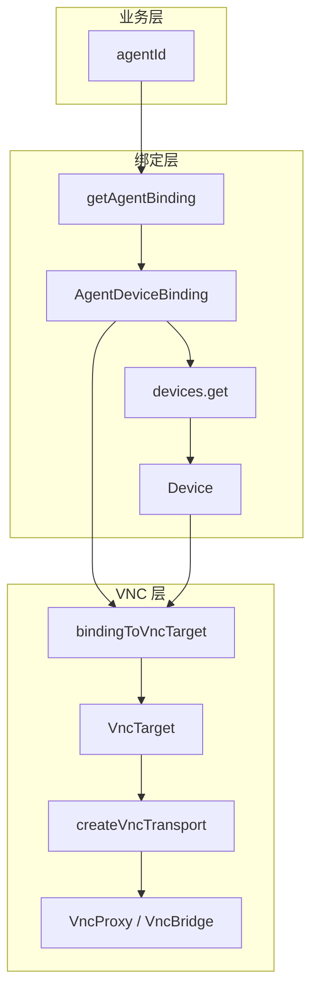

# NovAIC 前端 Agent 与 Device 数据流与绑定关系报告

## 1. 数据流总览

```
┌─────────────────────────────────────────────────────────────────────────────────┐
│                         Agent → Device → VNC 数据流                               │
└─────────────────────────────────────────────────────────────────────────────────┘

  agentId (业务层)
       │
       ▼
┌──────────────────┐     GET /api/agents/{agentId}/binding
│  getAgentBinding │ ─────────────────────────────────────────► AgentDeviceBinding
└──────────────────┘                                              │
       │                                                           │ device_id
       │                                                           │ subject_type
       │                                                           │ subject_id
       ▼                                                           ▼
┌──────────────────┐     GET /api/devices/{device_id}      ┌──────────────┐
│  devices.get     │ ◄─────────────────────────────────────│   Device     │
└──────────────────┘                                       │ pc_client_id │
       │                                                    └──────────────┘
       │                                                           │
       ▼                                                           │
┌──────────────────┐     binding + device                         │
│ bindingToVncTarget│ ─────────────────────────────────────────► VncTarget
└──────────────────┘                                              │
       │                                                           │ resourceId
       │                                                           │ pcClientId
       ▼                                                           ▼
┌──────────────────┐     createVncTransport(target)        ┌──────────────────┐
│  VncProxy / VNC  │ ◄──────────────────────────────────────│  VncBridge / WS   │
└──────────────────┘                                       └──────────────────┘
```

---

## 2. useAgentDevice

### 2.1 实现逻辑

**文件**：`novaic-app/src/hooks/useAgentDevice.ts`

**数据流**：
1. 输入：`agentId`（Agent 实体 ID）
2. 调用 `api.getAgentBinding(agentId)` → `AgentDeviceBinding | null`
3. 若有 binding，调用 `api.devices.get(binding.device_id)` → `Device`（带缓存）
4. 通过 `bindingToVncTarget(binding, device)` 派生 `VncTarget`

### 2.2 数据来源

| 来源 | API | 用途 |
|------|-----|------|
| 权威 | `GET /api/agents/{agentId}/binding` | 获取 Agent 绑定关系 |
| 权威 | `GET /api/devices/{id}` | 获取设备详情（含 pc_client_id） |
| 已废弃 | `api.devices.list(agentId)` | 注释中已弃用 |

### 2.3 返回结构

```typescript
interface UseAgentDeviceResult {
  binding: AgentDeviceBinding | null;  // Agent 绑定
  device: Device | null;               // 设备详情
  vncTarget: VncTarget | null;        // 派生 VNC 目标
  isLoading: boolean;
  error: string | null;
  refetch: () => Promise<void>;
}
```

### 2.4 设备缓存

- 模块级 `deviceCache: Map<string, { device, ts }>`，TTL 30s
- 同一 `device_id` 多次请求只调用一次 `devices.get`

### 2.5 使用场景

- `AgentDesktopView`：VNC 主桌面
- `AgentDrawer`：设备 tab 展示
- `DeviceManagerPage`：设备详情与选中设备
- `VisualPanel`：设备类型判断

---

## 3. useAgentBinding

### 3.1 与 getAgentBinding 的关系

| 项目 | useAgentBinding | useAgentDevice |
|------|-----------------|----------------|
| 数据源 | `getAgentBinding` + `devices.get` | 同左 |
| 优化 | 支持 `initialBinding` 避免重复请求 | 无 |
| 返回 | `{ binding, device, loading, error }` | 额外返回 `vncTarget` |
| 缓存 | 无 | 有 deviceCache |

### 3.2 实现逻辑

**文件**：`novaic-app/src/hooks/useAgentBinding.ts`

```typescript
// 有 initialBinding 时跳过 getAgentBinding
let b = initialBinding ?? null;
if (!b) {
  b = await api.getAgentBinding(agentId);
}
const d = await api.devices.get(b.device_id);
```

### 3.3 返回结构

```typescript
interface AgentBindingState {
  binding: AgentDeviceBinding | null;
  device: Device | null;
  loading: boolean;
  error: string | null;
  refetch: () => Promise<void>;
}
```

### 3.4 使用场景

- `DeviceFloatingPanel`：`useAgentBinding(currentAgentId, currentAgent?.binding)`，利用 agent 列表中的 binding 减少请求

---

## 4. VNC 与设备：VncTarget、createVncTransport

### 4.1 VncTarget 结构

**文件**：`novaic-app/src/types/vnc.ts`

```typescript
interface VncTarget {
  pcClientId?: string;   // 物理 PC 标识（VmControl Ed25519），用于路由
  resourceId: string;     // maindesk: device_id；subuser: `${deviceId}:${username}`
  subjectType: 'main' | 'vm_user' | 'default';
  deviceId: string;       // 逻辑设备 ID（devices 表主键）
  username?: string;      // vm_user 时有值
}
```

### 4.2 bindingToVncTarget 映射

**文件**：`novaic-app/src/hooks/useAgentDevice.ts`

| subject_type | resourceId | deviceId | username |
|--------------|------------|----------|----------|
| main / default | `device_id` | `device_id` | - |
| vm_user | `device_id:subject_id` | `device_id` | `subject_id` |

`pcClientId` 来自 `device?.pc_client_id`。

### 4.3 createVncTransport 与 VncTarget

**文件**：`novaic-app/src/services/vncTransport.ts`

```typescript
// 从 VncTarget 提取
const { resourceId, pcClientId } = target;

// OTA 模式：VncBridgeTransport
new VncBridgeTransport(resourceId, pcClientId);

// 非 OTA：Tauri invoke
invoke('get_vnc_proxy_url', {
  agentId: resourceId,   // ⚠️ 语义：实为 resourceId
  deviceId: pcClientId ?? null,  // ⚠️ 语义：实为 pc_client_id
});
```

### 4.4 Tauri 侧参数语义

**文件**：`novaic-app/src-tauri/src/commands/vnc_urls.rs`、`vnc_proxy.rs`

```rust
// get_vnc_proxy_url 参数
agentId: String   // 实际：resource_id（maindesk=device_id subuser=device_id:username）
deviceId: Option<String>  // 实际：pc_client_id（物理 PC 标识）

// ws_url 格式
ws://127.0.0.1:{port}/vnc/{vmcontrol_device_id}/{agent_id}
// 即 /vnc/{pc_client_id}/{resource_id}
```

### 4.5 agentId/resourceId 与 device 对应

| 层级 | 含义 | 示例 |
|------|------|------|
| 业务 agentId | Agent 实体 ID | `agent-xxx` |
| binding.device_id | 逻辑设备 ID | `device-abc` |
| VncTarget.resourceId | VNC 资源标识 | maindesk: `device-abc`；subuser: `device-abc:alice` |
| VncTarget.pcClientId | 物理 PC 标识 | Ed25519 hex |
| Tauri agentId 参数 | 实际为 resourceId | 同上 |
| Tauri deviceId 参数 | 实际为 pc_client_id | 同上 |

---

## 5. 混淆点：agentId、deviceId、resourceId、pc_client_id

### 5.1 语义对照表

| 标识符 | 含义 | 示例 | 来源 |
|--------|------|------|------|
| **agentId** | Agent 实体 ID | `agent-xxx` | API 业务层 |
| **deviceId** | 逻辑设备 ID（devices 表） | `device-abc` | binding.device_id | 
| **resourceId** | VNC 资源标识 | maindesk: `device-abc`<br>subuser: `device-abc:alice` | VncTarget |
| **pc_client_id** | 物理 PC 标识（VmControl） | Ed25519 hex | Device.pc_client_id |

### 5.2 混用场景

| 位置 | 参数名 | 实际含义 | 说明 |
|------|--------|----------|------|
| `get_vnc_proxy_url` | agentId | resourceId | 命名沿用历史 |
| `get_vnc_proxy_url` | deviceId | pc_client_id | 同上 |
| `vnc_bridge_connect` | agentId | resourceId | 同上 |
| `VncBridgeTransport` 构造 | agentId | resourceId | 同上 |
| `VncBridgeTransport` 构造 | deviceId | pc_client_id | 同上 |
| `vncStream.subscribeToVNCStream` | agentId | stream key（主桌面用 deviceId，否则 agentId） | 旧流式 API |
| `vmService.getVncTransport` | agentId | resourceId | 命名混淆 |
| `vmService.getVncTransport` | deviceId | pc_client_id | 同上 |

### 5.3 典型混淆

1. **Tauri 命令参数**：`agentId` 实际传的是 `resourceId`，与业务 Agent 无关。
2. **vncStream**：`agentId` 作为 stream key，主桌面用 `deviceId`，子用户用 `agentId`，语义不统一。
3. **VNCViewShared**：`streamKey = propDeviceId || agentId`，主桌面用 deviceId 作为 key。
4. **Device 类型**：`device.id` 为逻辑设备 ID；`device.pc_client_id` 为物理 PC 标识，易与 deviceId 混淆。

### 5.4 建议命名

| 当前 | 建议 | 说明 |
|------|------|------|
| get_vnc_proxy_url(agentId, deviceId) | get_vnc_proxy_url(resourceId, pcClientId) | 明确语义 |
| VncBridgeTransport(agentId, deviceId) | VncBridgeTransport(resourceId, pcClientId) | 同上 |
| vncStream agentId | streamKey / resourceId | 区分 stream 与业务 Agent |

---

## 6. 关键 Hook 与 API 汇总

| 名称 | 类型 | 输入 | 输出 | 用途 |
|------|------|------|------|------|
| `useAgentDevice` | Hook | agentId | binding, device, vncTarget | Agent 桌面 + VNC |
| `useAgentBinding` | Hook | agentId, initialBinding? | binding, device | 设备详情 + 浮层 |
| `getAgentBinding` | API | agentId | AgentDeviceBinding | 获取绑定 |
| `devices.get` | API | deviceId | Device | 设备详情 |
| `bindingToVncTarget` | 内部 | binding, device | VncTarget | 派生 VNC 目标 |
| `createVncTransport` | 服务 | VncTarget | VncTransport | 建立 VNC 传输 |

---

## 7. 数据流图（Mermaid）



---

## 8. 附录：类型定义

### AgentDeviceBinding

```typescript
interface AgentDeviceBinding {
  agent_id: string;
  device_id: string;           // 逻辑设备 ID
  subject_type: 'main' | 'vm_user' | 'default';
  subject_id: string;          // vm_user 时为 username
  mounted_tools: MountedToolsByCategory;
  created_at: string;
  updated_at: string;
  device_type?: string | null;
  device_name?: string | null;
  subject_label?: string | null;
  desktop_resource_id?: string | null;
  supported_tools?: MountedToolsByCategory;
}
```

### Device（相关字段）

```typescript
interface DeviceConfig {
  id: string;                  // 逻辑设备 ID
  pc_client_id?: string;       // 物理 PC 标识（VmControl）
  // ...
}
```
